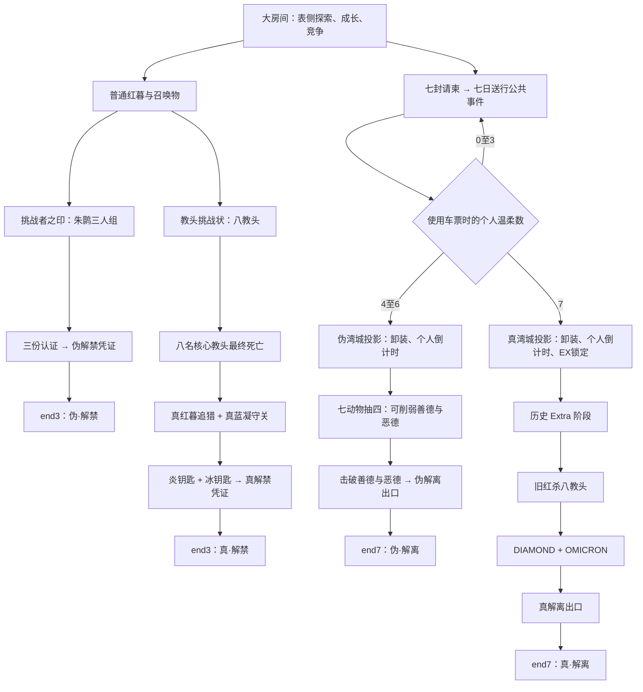

# PHPDTS 大房间四路线结局重构：源码核对与完善策划案

**版本**：v0.2，源码对照评审稿；2026-09-15。  
**源码基线**：`0312da8f3f77975e848a5f1a9fd897cc9447bdc8`。  
**范围**：以默认大房间为对象，用伪／真·解禁、伪／真·解离替代现有 PvE 结局路线。保留大逃杀中的竞争、合作、抢先完成和失败压力。  
**本次交付**：只新增本策划文档，不修改 PHP、配置、数据库、模板或美术资源；没有运行游戏或实施数值平衡测试。

## 阅读说明与结论

原案的价值在于四路线的主题分工、教头的角色辨识度，以及“七日送行 → 放下装备 → 深入投影”的结构。按当前源码落地时，它不是一批 NPC 配置扩充，而是一轮涉及结局、共享事件、战斗状态、地图隔离和持久化的系统改造。

最优先的工作是建立路线生命周期，再制作具体 BOSS。否则容易出现最后一只死了却不刷下一阶段、白凰每次交战重置而无法破盾、完成七任务却只能进入别人已经清空的战场、投影中被主地图全禁提前杀死等情况。这些不是把血量调低就能解决的。

本文使用以下标记，避免把草案和源码事实混在一起：

- **【现状】**：在上述提交的代码中静态核实。
- **【原案】**：上传文档的设计意图，包括其中标为“定案”的内容；这些表述不是本轮实装授权。
- **【建议】**：本评审为消除矛盾、补齐玩法而提出的规则；尚未代表作者最终批准。
- **【待补】**：现有材料不足，不能把猜测伪装成已经完成的规格。

本文的“问题”指不改变规则结构、可通过概率、阈值、时长、掉率等参数解决的状况；“挑战”指必须定义或改变规则、交互、状态归属、资源生命周期的状况。编码工作多不必然是设计挑战；数值过大也不必然只是问题，例如“必需目标永久不可发现”首先是出口设计缺失。

**按用途阅读**：第1–3节是路线替换、源码纠错和共同规则；第4–10节是完善后的逐模块玩法规格；第11–12节区分数值问题与设计挑战；第13节是文件、数据库、内容资源和迁移清单；第14–16节是验收、待决策与源码索引。

### 来源与证据使用

1. 主输入：`C:/Users/mapodoufu/Documents/zhenjiejin_jiaotou_spec.md`，共 26 节及附录。开头仍写“其余七人待续”，实际后文已扩展至四路线、七事件和真解离终局，不能按开头的进度描述估算工作量。
2. 主要证据：本仓库当前代码。下文以 `路径:行号` 标出定位；行号只对应上述提交。
3. 辅助背景：`D:/Github/dts-creative-consultation/references/phpdts-ending-mechanics.md` 的第 7 节补足朱鹮线的历史意图；`knowledge/01-世界观与时空体系/湾城地理与区域.md` 用于地图名称与风味。辅助资料也必须接受源码核验，不能替代代码事实。
4. 原案提到的历史 Extra 数据包、其他代码库中的技能和外部设定帖子，并未作为本轮可运行实现或验证结果。没有这些数据就不能声称真解离第一阶段已具备完整规格。

## 1. 四路线的目标与现有路线替换关系

### 1.1 完整路线图

图中的朱鹮认证、两个解离出口的领取与使用规则是本稿补齐的建议。原案对最后如何获得终局物品、谁有权触发胜利写得不完整，不能只做到“BOSS 死亡”就算路线完成。

### 1.2 现状 → 改造目标

| 现有内容 | 当前功能 | 本稿建议的大房间处理 | 需要同步处理的内容 |
|---|---|---|---|
| 普通红暮，type 1 | 掉挑战者之印、真红蓝召唤物、黑色碎片等 | 保留入口角色；改造掉落组成 | 开局 NPC 表、普通红暮台词、道具说明、重复召唤检查 |
| 旧执行官三人组，type 7 sub 0–2 | 三张社员 ID 卡合成解除钥匙 | 默认入口改为 FP 三人组；旧三人组作为历史内容保留或迁移 | 印 I／II、隐藏 DEBUG 分支、ID 卡来源、YELLOWKNIFE 的实际独立配置 |
| FP-T0KI「HOROU」、FP-TOK1「ORIHIME」、FP-TO2I「SAYA」，type 7 sub 3–5 | 已有 NPC、技能与掉卡 | 作为伪解禁主体，补唯一认证与路线来源 | 不能仅把“执行官”几个字换成“朱鹮”；现有反弹、勇谍等仍需平衡 |
| `【我想要领略真正的红杀之力】` | 直接召唤真红暮、真蓝凝 | 替换成八教头挑战入口；旧同名物转纪念品或走新入口 | 所有取得方式、已有物品实例、改名及元素合成旁路 |
| 真红蓝，type 19 | 炎／冰钥匙 → `Zv` 解除钥匙 | 保留双钥匙结构，前置八教头，终战改为一追一守 | 分段伤害、撤离、现有特殊反击、成就、尸体与钥匙丢失恢复 |
| Dark Force，type 12 及进化表其他 `x` 钥匙 | 独立解除钥匙出口 | 移除“直接结束本局”的职能，改为成长或纪念奖励 | 所有解除钥匙生产配方、掉落、成就 102 旧意义 |
| `『C.H.A.O.S』`、三石、`『G.A.M.E.O.V.E.R』` | 旧解离链；元素大师另有捷径 | 默认大房间旧链退出结局资格；七日送行成为新入口 | 普通／元素合成、使用处理、提示、武神之魂等旧素材用途 |
| 英灵殿、武神、天神 | 武神之魂等资源与旧解离关联 | 代码洪流／大排档承接新任务；英灵殿改彩蛋 | 地点 34 的硬编码、禁区列表、Untainted Glory 门槛、旧 NPC 与掉落 |
| 杏仁豆腐 ID 卡、死斗、最后幸存、核爆、GM 中止 | 全局结束或推进机制 | 保留非 PvE 结局，但明确与投影的优先关系 | 不能让投影免禁区只停留在 UI 上；见第 3 节 |

**替代范围不是删除所有旧素材。** 可保留有其他合成用途的黑色碎片、琉璃血、武神之魂等，但在默认大房间中，它们不得再绕过新路线直接取得有效终局凭证。历史规则集继续使用旧流程，需要按房间条件分派，不能全仓替换物品名。

### 1.3 路线定位

| 路线 | 核心体验 | 成功所需能力 | 原案应补齐的内容 |
|---|---|---|---|
| 伪解禁 | 三名强敌与可借用能力的短路线 | 理解反弹、保命阈值、换装，完成基本成长 | 完整朱鹮入口、认证防旁路、结局文本 |
| 真解禁 | 八项机制考核后的一追一守 | 装备准备、风险识别、追猎与持续作战 | 护盾／追击可达性、多人阶段计数、凭证归属 |
| 伪解离 | 温柔未尽后的投影压力战 | 资源重建、优先拆动物技能、在限时内完成战斗 | 永久封死的解法、个人状态如何作用于共享 BOSS |
| 真解离 | 完成送行后的历史与五柱终局 | 多武器准备、机制切换、有限容错的连续作战 | Extra 名单、入场装备供给、学习／窃盗的可验证规则 |

“伪”应表示叙事结果和入口条件，不应自动等同于低难度；但伪解离也不应因为随机出现三种无法反制的残余技能，反而普遍比真解离更难。必须通过实测给四条路线分别定级。

## 2. 原案与源码的关键差异

| 编号 | 原案判断 | 源码核对／影响 | 必须采用的处理 |
|---|---|---|---|
| F01 | type 23 羊、24 幻象、25 教头、26 鹅群可直接新增 | `cache/resources_1.php:138` 起已有使徒／巫师／佣兵／歌神；`cache/addnpc_1.php:1979` 有佣兵，`cache/npc_1.php:1688` 有 type 26 | 先做类型与子项编号清册，使用未占用编号；本文不预占数字 |
| F02 | 玩家与 NPC 是同一 Player 对象，所以技能天然两用 | 都用 players 记录与 PHP 数组，但多处按 type、club、名称分支 | 共用计算函数可以做；授予、AI 发动、UI、状态保存仍须分别实现 |
| F03 | typeinfo 在 npc 表注册；图标／状态表改一份即可 | 运行资源经 `config()` 解析，主要是 `gamedata/cache/resources_1.php`；源表与 cache 不是同一文件 | 明确可维护源与生成链；检查后台写入，不能只改未被加载的副本 |
| F04 | 铁城 dice=0 可在全局概率 0 时强制追击 | 追击采用严格概率比较；0 不小于 0 | 在原资格检查后设置该技能的独立概率／结果，不用伪造骰子绕流程 |
| F05 | WK 是拳系、WGK 只是狙击枪 | WK 是斩；WGK 为可转斩的枪刃。当前 WB 确为弓，WJ 为重枪 | 铁城拳脚选空手 N 或殴 P，巨剑才是 K；灵翼用符合预期的 G／J 配置，不能借名称定义行为 |
| F06 | L/S/M 射程、爆系可自然同射程对轰 | 实际为数值射程及修正；配置中 N/P/K=3、G=7、C=5、D=0、F=1、J=8、B=5 | 用实际射程数字与反击条件设计；长射程不自动提高基础先制，范围伤害和全图狙击不是武器名自带 |
| F07 | 弓每 200 熟练加射程且封顶 3 可直接依赖 | `revattr.func.php:94–98` 把封顶赋给 `$r` 而非 `$r_add`，随后仍使用未封顶增量 | 先修正／确认基础算法再标定破石；不是靠注释推导出已验证射程 |
| F08 | 爆头对满血无效 | `c4_headshot` 比较的是目标当前 HP 的伤害比例，满血同样可能触发 | 明示爆头条件；如设计需要满血安全，另加规则，不能只改描述 |
| F09 | 每次交战／回合／多段命中可互换 | 新战斗是一轮先攻、可能反击／追加、收尾；普通交战后会清 `battle_turns` | 第 4 节定义事件单位；“3 回合”必须指定按谁的何种行动消耗 |
| F10 | AA 护盾 4 次多段命中破盾，战后重置即可 | AA 在命中次数汇总后的固定伤害分支只判一次，且玩家与 NPC 的能量方向不同 | 白凰使用专用符层；不能一轮只消一符却每轮补满；玩家掉落转换为玩家版参数 |
| F11 | 全灭钩子放击杀成就，查 hp>0 就覆盖所有死因 | `state.func.php:331` 附近的成就只覆盖玩家击杀；死者此时还可能未保存 | 最终死亡落地后统一推进，复活／撤退／销毁不误算；后台复核 |
| F12 | winners 可能缺 itmsk 列 | `system.func.php:669` 已保存多个物品后缀；缺的是稳定的路线及触发上下文 | 记录 route_id、版本、凭证来源与实际胜者名单，不靠翻背包推断 |
| F13 | 修改 default/end.htm 即得到新结局 | `end.php:55` 加载 `ending`，再载 `ending_story` | 改实际页面链与历史展示；end.htm 只作为遗留入口审计对象 |
| F14 | 七任务是现成 QUEST 的配置扩展 | 已有任务有个人绑定及同时接取限制，不能承载公共单实例直接复用 | 保留任务面板／道具工具，新增公共事件、周期、参与贡献与结算层 |
| F15 | 没有地面物品系统 | `mapitem` 表、`itemdrop()`、搜索拾取已经存在 | 电池用现有地面物品结构并扩展批次配额，不另造相互不通的假掉落 |
| F16 | horizon=2 天然隔离伪真投影 | NPC、地图物品、陷阱、视野与死斗例外的隔离条件不同 | 空间身份统一校验；建议真伪投影分配不同 pls 组，复用名称与美术 |
| F17 | 隐藏地图天然免主地图终局 | 主世界全禁可查杀全部 type=0；剩一人会自动结束；死斗搜索会过滤 NPC | 同步修改禁区、终局、NPC 退场与遭遇规则 |
| F18 | 所有视界行为都只写 `==1` | 也有 horizon 真值判断，2 会继承部分恢复效果 | 对所有入口与效果做能力清单，禁止“一律按 1 处理” |
| F19 | 取服务器 deadline 给 JS 即精确 | `$now` 带站点时间偏移，见 `common.inc.php:31`；请求还可能等待文件锁 | 下发服务器当前值与剩余秒数；服务端在持锁后取统一时刻，客户端仅显示 |
| F20 | 直接 UPDATE pls／clbpara 就能安全换位和加状态 | 战斗后 `player_save()` 会按内存数组整行保存相关字段 | 在持锁上下文修改权威数组，清视野／bid，统一保存，防刚写入又被旧数据覆盖 |
| F21 | 所有状态塞入 inf 即可 | `players.inf` 为 char(10)，现有状态使用字符集合，缺来源、层数、到期和免疫语义 | 新机制主要存结构化状态；inf 只作兼容展示或明确注册的一位效果 |
| F22 | get_fix_damage 可作“最终伤害后附加真伤” | `revcombat.func.php:405` 起固定伤害分支会跳过常规计算 | 区分固定伤害、穿防、附加伤害、直接死亡；在统一提交伤害前处理最终规则 |
| F23 | 默认掉落会给每位参与者 1–2 件独立奖励 | 当前主要是尸体及其有限装备／物品槽，可能被抢、被毁、被耗掉 | 区分战利品和路线资格；专属箱、归还仓库、个人领奖都需新逻辑 |

### 2.1 原案内部也有版本冲突

- 第 1.1 节示例把 sub 1 写为绯刹，后续人物表是灵翼；编号须以统一角色注册表为准。
- 第 1.7 节规定准备阶段分派，后续又把埋雷、挂影放到结果阶段；两者不能合并成一个万能钩子。
- Q2 前文说清光敌人提前结束无温柔，后文说守满时间且杀两只才有温柔；必须统一胜利条件。
- Q4 前文要求远程精准击破，后文只要求用过眼镜；前者又与“不设武器系门槛”冲突。
- Q7 前文是护送，后文只是赶到对话；工作量和实际体验完全不同。
- 七动物前文强调倒计时阈值驱动，后文又强调每次交战叠加，Holly 还使用命中／伤害；必须拆成时钟压力与个人战斗状态两个来源。
- 三锁瘫痪、100% 免死、永久找不到人的终点，与“只能从未刷出的三种技能中硬打过去”存在结构冲突。
- 真解离“每地点仅一体 BOSS”与 DIAMOND／OMICRON 可同点冲突；本稿默认分点。
- 红蓝的实现表一度统一写 mhp/10，蓝凝实际意图为两段，必须按角色独立配置。

## 3. 完善后的共同规则：先把本局怎样开始和结束说清楚

本节是建议基线，任何一项改变都应反映到任务文本和验收中。

### 3.1 大房间范围与胜负归属

1. **只在默认大房间启用**：以 `groomid=0` 和显式模式版本开关限定；小房间／历史 RuleSet 保持各自配置。不能仅凭物品同名改变所有房间行为。
2. **沿用全局比赛结束语义**：第一份合法终局凭证成功结算，整场比赛结束；四条路线是竞争出口，不是同一局可依次观看四次的个人副本。其他路线参与者获“本局由其他路线终结”结算页，而非倒计时死亡。
3. **胜者资格修正**：解离触发者及共同胜者必须是该路线本批次登记、仍存活且未超时的合格成员，不能把表侧挂机队友或另一条路线队友带进真解离成就。解禁没有个人投影期限：存活的合法凭证持有者可触发，允许战利品抢夺；其共同胜者建议限定为同队、存活且参与过本线核心战斗者，若无共同参战则只结算持证者。全队普惠若坚持保留，应明确它会允许跳过前置；本稿不推荐。
4. **个人成就与全局结局分开**：教头／事件助攻、阶段完成可以记个人记录；只有通过出口结算才获得对应通关成就。败于另一条路线不扣已经取得的送行完成记录，但本局结束后重置局内进度。
5. **非 PvE 终局**：GM 中止与核爆仍可结束整局，需在投影入场说明中列出。自然全禁只影响表侧，仍有有效投影挑战者时暂缓 end1／end2；所有有效参战者均死亡或路线失败后恢复常规收尾。此项是投影“有独立时长”的必要改造。

若目标其实是允许同局多条路线各自通关，必须另做个人退场、活人数统计、多人结算和持久化；不能继续直接调用现有全局 gameover。本文不把这一替代方案混入默认规格。

### 3.2 共享 BOSS 与个人期限

【原案保留】教头、动物和终局 BOSS 按本局共享，不给每人复制一套；送行进度与投影截止时间按人保存。

【建议补齐】每条投影路线引入一个**挑战批次**：

- 第一位合法使用车票者创建批次和初始 BOSS；随后短暂开放加入。进入后每人获得自己的完整基础时长，建议起测值 75 分钟。
- 加入窗口长度单独配置；第一名核心 BOSS 被正式击破或窗口到期时关闭加入。所有 BOSS 全灭／批次失败后不能再把新人扒光送进去。
- 入场确认页必须显示“开放／已开战且截止／已完成”，后端点击时再次校验；关闭时不消耗车票、不卸装。
- 已关闭批次本局不重刷；这是本局竞争规则。任务达到 7 后仍可选择本局尚开放的其他正常出口，但不能把 7 降成 6 来偷进伪解离。若作者希望所有晚到者都有机会，则必须改成可重开的公共批次并解决尸体、掉落、补给和领奖去重，工程与玩法范围都要增加。
- 阶段推进为本批次全局状态；个人超时只使该玩家退场。最后一名有效挑战者失败则批次失败、停止 AI 和陷阱扩散。
- 真解离加时只发给阶段结束时本批次有效参战者，按阶段编号最多一次；后来进入者不能领取历史加时。
- 速杀奖励的时间基准是阶段激活时刻，不是最后击杀者的入场时刻。建议 `奖励秒数 = max(0, 阶段参考时长 - 实际耗时) × 奖励倍率`，设奖励上限；不做慢杀加时默认档。

这一加入规则是对“公共单实例 + 每个人随时入场”的必要取舍，应在实装前确认；不能靠增加 BOSS 血量掩盖晚到玩家无目标的问题。

### 3.3 局内状态划分

| 状态层 | 建议记录 | 为什么不能只用一个计数 |
|---|---|---|
| 房间／本局 | `mode_version`、不可变 `round_token`、展示局号 `gamenum`、路线开放状态、共享 BOSS 注册表、结局是否已提交 | 隔离上一局残留；识别重复召唤与重复结算；gameover可能调整局号，不能依赖展示局号重新计算实例身份 |
| 路线／批次 | `run_id`、stage、参与者、加入截止、阶段起止、必需 boss_id 集合、加时发放标记 | type 数量不能分辨本批次、随从、第二形态和旧尸体 |
| 公共事件周期 | event_id、cycle_id、起止时间、波次、保护目标 HP、资源配额、最终结果 | 防点击频率影响波次和旧周期道具冒领 |
| 玩家 | 每任务完成／温柔记录、贡献、route_id、run_id、entered_at、deadline、退场状态 | 温柔数从七项布尔记录推导，重复请求不会加到 8 |
| NPC | 稳定 boss_id、owner／run、phase、AI 冷却、专属状态 | 不依赖中文显示名；进化改名仍是同一核心目标 |
| 成对状态 | source boss_id、target pid、状态种类、层数、到期、下次可触发时刻 | 破石仇恨、三步影、DIAMOND 记录不能相互污染 |
| 道具实例 | 来源路线／批次、角色、有效次数、是否可交易、退场处理 | 名称与 itmsk 仅作展示／兼容，不能单独证明通关资格 |
| 最终记录 | ending_route、ending_version、trigger_pid、触发凭证快照、合格胜者、结果摘要 | 清包、卸装、重命名或新开一局后仍能还原真实结局 |

首版可以把有界状态放在已有 `gamevars`／`clbpara`，不必为每个标记加数据库列。但公开贡献、窃盗物品仓库、归还领取记录可能很大，需要有大小上限；超出有界 JSON 方案再增专用表。无论使用何种表，必须形成清晰的保存顺序和重入恢复方案。

### 3.4 调度、死亡与阶段推进

- 现有 `common.inc.php:163` 使用 `process.lock`，但在 `:289` 关闭，早于实际 command 行动，不能当作整场战斗和事件结算都已串行化。bot 另有自己的行动锁，不能自动互斥玩家请求。需给新路线的读取、判定、变更、保存建立共享行动锁，并规定锁顺序；现有 MyISAM 表不能靠一段事务伪代码自动获得原子性。
- 固定间隔事件依据服务器已过时间处理，记录 `last_tick_at` 和下一到期时间；玩家多搜索不能让鹅多扣血、三步多传送、烬锤多埋雷。随机搜索可以触发检查，不能承担唯一计时器。
- 每个有效行动前刷新期限与权威状态；超时者不得攻击、拾物、投影、领奖。目标是离线玩家时也须先判定其期限。对锁等待较久的请求使用持锁后的时间，不能依赖过期的请求入口 `$now`。
- 后台心跳保证无人操作也会到期；心跳中断时在下次请求补算并保留实际到期时间。玩家界面不得声称客户端倒计时自身执行死亡。
- 正式死亡完成并保存后，统一通知路线系统；以本批次必需目标登记表判定全灭。复活、半血进化不是死亡；被管理清除、强制退场也不能自动算击破。
- 【建议】自然死亡若确属游戏内合法击杀可计进度，但保护型核心目标不要依赖禁区自动清场；意外退场优先修复／重新安置并广播。原案“任何清空都算全灭”会允许跳过战斗，需限定死因。
- 推进必须幂等：最后两只几乎同时死亡、重复刷新、服务器重启，都只能生成下一阶段一套目标、奖励一次、广播一次。生成失败可重试补齐缺少的角色，不能把空表视为已经通关。
- 事件波次和无掉落随从应从大房间的连斗／死亡人数推进统计中明确排除，否则七事件持续刷怪会改变整局进入连斗的速度。默认死亡阈值为160＋ceil(玩家数/20)×20；1–20名玩家时为180。死斗是另一阶段，不能把两者混称。
- 投影合法参与者以个人deadline处理离线失败，豁免旧 `antiAFK()` 的表侧挂机死亡；否则20分钟反挂机可能先于75分钟投影到期。表侧挂机规则保留。管理中止与其他全局终局仍按3.1处理。

## 4. 战斗公共语法与技能框架

### 4.1 事件单位和结算顺序

当前新战斗主路径为 `revbattle_prepare → rev_combat_prepare → rev_combat → rev_attack → rev_combat_result`；`revcombat.readme.txt` 可作导航，但实际调用条件必须以 PHP 为准。旧 `battle.func.php`／`combat.func.php` 仍有调用者和特殊路径，需要先盘点谁使用新引擎、谁使用旧引擎，不能只加一个现代函数就宣告玩家和 bot 全部支持。

| 术语 | 本稿定义 | 典型用途 |
|---|---|---|
| 遭遇 | 搜索／视野／强制事件进入一次可战斗接触 | 先制、发现、AI 落点 |
| 战斗交换 | 一次服务器处理的先攻及其可能反击、追加打击，直到收尾 | 每次交战叠层，红暮最多一段 |
| 打击 | 一次 `rev_attack` 的攻击尝试 | 消耗弹药、命中后触发 |
| 命中段数 | 本次打击聚合计算得到的实际命中次数 | 连击伤害；默认不等于叠三层毒 |
| 命中事件 | 命中次数大于 0，伤害可能被护盾变成 0 | 暴露隐身、挂标记、命中即撤离 |
| HP 损失事件 | 实际扣除了生命 | 按实伤计贡献、吸血、伤害回战意 |
| 战斗会话 | 一段持续接战，直到成功脱离或任一方死亡／转场 | 主动技“每场一次”、铁城追击次数上限 |
| 墙钟状态 | 到指定服务器时间失效，与点击次数无关 | 现形 120 秒、影 300 秒、个人倒计时 |

新状态不得在渲染 profile／tooltip 时推进。主动攻击、被动反击、NPC 对 NPC、协战、追加打击必须有明确的触发范围。建议所有“每交战 +1”按战斗交换的唯一编号去重，命中叠层每交换每来源最多一次；例外多段机制在技能卡中明确写出。

**必要的新事件出口**：被攻击尝试、命中但零伤、实扣 HP、最终死亡、整个战斗交换完成。当前 `revcombat.func.php:112` 只在非零伤害时进入部分结果处理，`:675` 的 `attack_result_events` 也不是通用“命中后”。白凰护盾、红暮撤离不能只挂在那里。

建议最终伤害顺序为：合法目标与期限 → 先制／攻击资格 → 招式选择 → 命中 → 常规物理和属性伤害 → 本模式增伤／额外伤害 → 护盾与明确的减免 → 路线分段／保命／处决裁决 → 统一 HP 提交 → 复活／死亡 → 状态与战利品 → 撤离／阶段推进。此顺序是待实施的契约，不是对现有函数位置的描述。

固定伤害分支、反弹、脚本扣血、陷阱、持续伤害和即死都须接入同一“最终生命变更”规则。若只封顶物理伤害，直死或脚本就仍能一击跳过十段；若把处决放在护盾前，也必须明确护盾是否保护处决。

### 4.2 技能化的实际边界

- 公共技能主体用稳定 skill_id；NPC 与玩家参数分开配置。技能识别基于已授予技能和合法参数，不使用姓名字符串当技能开关。
- 当前 `clubskill`、`clubskillpara` 经初始化变成 `clbpara['skill']` 与 `skillpara` 等结构；svars、timed、switch 有具体生命周期，不是任意 JSON 填进去就自动执行。
- NPC 需要自动开关和主动技能选择策略；玩家需要解锁、SP／怒气／弹药消耗、目标选择、冷却、失败退费规则、技能面板和帮助。
- 八教头掉落装备与“未来天赋树授予技能”分开。**第一版路线只要求 NPC 技能和掉落装备完整，天赋树取得途径为后续独立工作包**；若本次模式上线必须同步玩家技能，则第 6 节的玩家档全部进入验收范围，不能只写一条技能配置。
- “同类取高不叠加”需要明确效果类别：命中、先制、逃跑、破防、护盾、陷阱倍率分别比较。不能把不同效果的两个技能整体只选一个；也不能既乘旧技能、又在最后乘新技能。先计算各来源，再按该类别规则合并。
- 默认新控制状态保存 `source_id / stacks / expires_at / remaining_actions / immunity_until`；治疗应能判断它是普通中毒、特殊毒层还是路线永久记录。原案的 `'l'` 不能兼任腕、腿、颈三类控制和处刑标记。
- 控制必须有玩家可见的反制入口。当前战斗菜单不能等同于“随时吃药”；如铁城持续接战时允许挣脱／治疗，应给菜单增加对应行动或允许安全脱战窗口。

### 4.3 攻击与资源语义补正

1. 铁城拳系建议空手 N 或殴系 P；巨剑作为 K 系掉落。装备名可以是指虎，但不能让 WK 自动变成拳法。
2. WB 在当前新引擎是弓，原案破石这一点正确。需要核验弓弹药字段和射程增量现存问题；不照旧文档把 B／J 对调。
3. 枪械 `weps=∞` 在当前分支有空弹／非射击判断风险，WGK 还可能切为斩。灵翼要配置可工作的弹药与装填策略，或者显式增加 NPC 无限弹仓能力，不能直接用无穷耐久符号替代弹药。
4. 武器属性 `r` 是连击，不能当“射程压制”。射程通过 `get_wep_range` 等数值主要决定反击资格；先制另有概率计算，若要狙击先制加成必须另行配置或实现。
5. c4 技能有武器、投资、开关等条件；c7 电气主动技能也有怒气和 AI 选招条件。只在 clubskill 列写三个名字，不等于三项效果永远常驻。
6. 多种“火、冰、电、毒”是额外属性及异常标记；WF 是灵系，不是“火弹”类型。四弹种应给同一枪械攻击方式附不同属性或专门弹种参数，不能为了换燃烧弹偷偷切成另一套熟练度体系。
7. 专属装备若被战斗耐久破坏，尸体不会自动重新生成完好战利品。保证掉落的装备要通过独立奖励模板产出玩家版，避免把 NPC 的无限资源、控制免疫和反击脚本一并带给玩家。

## 5. 伪解禁：补全朱鹮路线

上传案仅简略提到朱鹮线；本节结合辅助背景和现有 FP 三人组提出完整基线。

1. 普通红暮仍提供挑战入口；`挑战者之印` 在默认大房间召唤现有 FP 三人组，每人一次。印 II 在新版本应转同类入口或纪念品，不能额外无限刷认证。
2. 保留 HOROU 的破虹／换装、ORIHIME 的解放／飞行、SAYA 的来潮／勇谍作为三种考核；补清晰预警、低伤攻击选项以及最后补刀规则。不能把其特殊效果概括成“普通三只小 BOSS”。
3. 【建议】三人各给一个不同来源的认证片，合成为伪解禁凭证。继续使用三张同名 ID 卡的美术也可以，但 `itmpara` 必须携带不同角色来源；三次击杀同一只不能代替三人全灭。
4. 阶段 registry 证明本局三人已正式击破；凭证使用者持有合法合成凭证即可触发，沿用大房间可抢夺战利品的竞争性。若需助攻直接得个人资格，则另增领奖，不能假称尸体掉落本来支持。
5. 原三执行官和旧卡配方在历史 RuleSet 保留；默认大房间的元素分解、重命名、掉卡和旧物品使用处理拒绝绕过三人组。
6. 伪解禁仍为 end3，但持久化 `release_false` 路线。剧情表达“按流程解除锁定，未触及深层红杀力量”；不再向玩家讲述实际未发生的旧三执行官故事。
7. Xharmer／平台借用 FP 能力可作为成长支线继续，但要测试能否携带强力平台一键跳过新教头或解离卸装。天赋与平台交互需列入对战样本。

## 6. 真解禁：八教头与红蓝终局

### 6.1 召唤、分布与奖励

- 挑战状使用前检查大房间版本、仍可挑战、核心八人是否已生成、可用位置、物品合法性；成功后一次性登记八个 boss_id，并生成所有角色和需要的随从。重复使用只显示进度，不吞物也不重生死者。
- 八人主要在安全的表侧地点分散出生；电反与羊同点、白凰与幻象同点。可用安全点不足八个时允许合理同点并明确 UI 列表，不能无限重掷随机数；是否限制挑战状的最晚使用阶段单独配置。
- 电反、灵翼、绯刹的“守点”用哨兵／AI 规则实现；rage影响技能资源及相关伤害，不决定遭遇、主动猎杀或位移。三步则受限于本批次表侧活跃玩家和安全地点。
- 八名核心全灭才生成 type 19 红蓝；羊、幻象不计八人。教头死亡后立即解除其据点光环和个人标记，并清理其无用随从；已埋陷阱按明确有效期保留或淡出。
- 各教头配置 1–2 件代表战利品；信物默认作为剧情／图鉴记录，若做持久收藏，另建解锁与去重规则。NPC 战斗装备不要求全部可原样掠夺。

### 6.2 八人逐项规格

表中 HP／攻／防为**原案基准值保留备查**，没有经过实战验证。实际伤害还吃武器、熟练、属性、姿态、天气及技能，不能称为已经平衡的面板。

| 角色、原案面板 | 保留的战斗主题 | 新增／更改逻辑 | 本稿建议的可操作反制与资源 |
|---|---|---|---|
| 铁城·Rook；60000／6500／5000 | 直线压迫、追击、擒抱、铁壁反打 | 追击外层门控与独立资格；有来源的锁缚；固定补伤、耐久打击；铁壁预告和下一交换增伤 | 追击最多连续若干次后给脱离窗口；锁缚可挣脱或治疗，不强制永远接战。指虎／巨剑玩家版、车令、锁缚图标、三招台词 |
| 灵翼·Bishop；25000／8000／2000 | 据点狙击与弹种分析 | 正确弹仓和射程；c4 技能参数；换装策略；必要时专用弹种选择，不把 club98 当智能抗性分析器 | 射击预告、穿甲／燃烧／爆裂／标准弹明确效果，允许高射程或减伤对抗。狙击枪、光环、象令、弹种提示 |
| 破石·Knight；28000／7500／2500 | 单目标解析、他人打断 | 保存 target、层数；命中后更新而非同击先吃新层；攻击方破防系数；第三人有效命中打断 | 层数 0–5 可见；换人清除目标或减层须二选一。本稿建议换目标清零，第三人命中减半但保留原 target。复合弓、研究笔记、马令 |
| 银锤·Pawn；20000／4500／2200 → 32000／7000／2600 | 地雷表演、半血过河 | 半血阶段切换且不误算死亡；有归属／时效／数量上限的埋雷；本地到扩散；广播节流 | 公布雷区摘要和拆雷渠道；不是“离开她所在点就能无伤打她”。阶段 HP 建议保持比例或增加指定量，不能意外回满32000。压轴烟花、返场彩蛋、兵令 |
| 电反·King；30000／5000／3000；两羊各8000 HP | 拆中继削干扰、电气输出 | 羊绑定 owner、同点出生；独立修理时机；命中／据点干扰；电子物品白名单；电气技能 AI 与怒气 | 杀羊是永久削弱，但羊不在每个一击交换后回满，否则低爆发永远杀不死。可用长脱战冷却修理；羊数、干扰剩余时间可见。干扰器、王令 |
| 三步·Queen；12000／9000／1500 | 落影袭击、三影危机 | 服务器间隔调度、活跃目标选择、一次强制遭遇队列、命中叠影、撤离、死亡清理 | 落点预警、个人被选冷却、显式反击窗口；每交换最多一影。第三影处决先有可清除或安全间隔，不能三连击一请求满层。提灯、后令、影状态 |
| 白凰·PAO；22000／6000／2000 | 破符后输出、幻象干扰 | 专用符层或受伤盾；跨交换保存，零伤命中也触发；幻象上限与生成冷却；符碎阶段减弱弹幕 | 四符破完后开放足够的伤害窗口，再按时间或阶段补符；不能战后立刻补满。幻象本身不会在单体战斗里自动替她挡刀，要明确是遭遇压力还是可攻击护盾目标。玩家护符、法杖、炮令 |
| 绯刹·SHI；15000／10000／1200 | 据点潜伏、出手暴露、毒 | 搜索者与目标成对隐藏修正、现形时效、主动伏击路径、命中中毒 | 若发现率为0，普通遭遇可能连她的攻击都到不了，必须保留侦察现形／预告伏击入口；无需玩家先送命才能见到。匕首、解毒提示、士令 |

**铁城额外纠正**：`revcombat.func.php:177` 外层就以全局追击开关决定是否调用 `check_can_chase`。同时要改外层和函数内资格；保留仅 NPC 对合法玩家且双方存活／同场等前提，不能用“任一方有该技能”把 PvP 追击一并打开。

**破石的满层破防**：不能把防御乘成 0。当前原始伤害包含除以防御的公式，0.01 的下限也可能形成天文伤害。建议满层为“忽略明确比例的防御，保留最小有效防御”，或另定义有上限的固定附加伤害；若坚持完全穿防，则需要独立伤害公式。

**银锤与红蓝伤害阶段区别**：银锤是改变 AI／面板的形态；红蓝是同一身份上的生命阶段。`evonpc()` 确实会按type/name写数据库并回满新HP/SP，但战斗内存也要同步，否则之后的保存会覆盖；还须避免同名实例一起变身。建议按pid切换阶段，并明确是否允许一击致死跳过半血形态，本稿默认阶段阈值先截断并完成过河，过量伤害本交换不继续结算。

### 6.3 玩家档技能工作表

保留原案技能方向，但下列代价均为起测值。掉落装备与技能授权独立；一个技能配置名不等于已经具备完整玩家版。

| NPC 来源 | 玩家版保留意图 | 必补规则 |
|---|---|---|
| 铁城 | 擒抱 SP250，一会话一次；追击中先制+10 | 玩家档能否触发追击需另定；关闭全局追击时被动可能没有触发场景。失败是否扣 SP、对 BOSS 控制抗性、挣脱成本 |
| 灵翼 | 狙杀 SP300、耗弹／耐久，部分破防，失败后减防减闪；先制+30改为探索期预备、下一遭遇生效 | 当前先制先于战斗菜单选招，不能战斗中发动后追改已经判完的先制。需预备状态、有效期、成本扣除时机、取消／未开火退费；爆头概率和满血规则另定 |
| 破石 | 解析开关、命中叠层、开启承伤+15% | 换目标／被第三人打断的准确时点；满层规则；对技能固定伤害的影响 |
| 银锤 | 陷阱增伤、概率升级压轴烟花 | 当前是否存在埋雷数量限制、+1加在哪里；与拆弹技能取高范围；地图／批次归属、上限和失效 |
| 电反 | 命中概率干扰，探索期电子设备受影响 | 电子物品白名单、失败是否耗物、buff来源、离开和治疗解除；禁止影响结局确认等系统命令 |
| 三步 | 低移动消耗、移动后首击先制；三次先制命中奖励伤害 | 免费移动与原社团组合；何为真实移动、原地来回防刷；计数在反击／换目标清除 |
| 白凰 | 战斗外 SP400 生成1500–2500符盾、灵伤+20%、耗尽冷却120秒 | 重复施放是否覆盖；被偷／投影／复活如何处理；伤害吸收顺序与上限 |
| 绯刹 | 降低被发现率、先制加成、攻击附毒 | 保留可发现下限／侦察反制；普通毒与特殊毒层分离；同类隐藏技能叠加上限 |

### 6.4 真红暮追猎与真蓝凝守关

**保留结构**：八教头之后两人同时生成。红暮 10 段，建议总 HP100000；蓝凝 2 段，原案沿用 HP9999998。两人共享全场进度，炎／冰均要取得。

**补齐分段定义**：

- “单击上限=最大HP/10”只能限制每次扣血，不保证十次交战。多次追加打击可在一次接战里打多段，跨越段线也会混乱。
- 建议以生命阈值为段界，**每次战斗交换最多打到下一段界**；多段、追加、反击、反弹等合并受同一段界约束。段界突破后本交换不再对该 BOSS 扣 HP，但其他合法副作用是否生效须逐项定义。
- 红暮在本交换结束且存活时撤离，先完成该交换约定的反击与伤害，再清所有引用她旧位置的 action/bid/视野，迁往同组安全点并广播确切地点；其他玩家旧页面请求也要重新校验目标位置。撤离不是新一轮免费攻击。
- 【建议改动】红暮被零伤命中不立即撤离，只在实伤或破段后撤离；原案“护盾完全挡住仍跑”会放大无意义追逐。若坚持命中即跑，必须有独立零伤命中出口、破盾进度持续、最大连续无伤撤离次数。
- 蓝凝原地战斗；半血阶段只改变演出或雷池参数，不自动回血。埋雷有上限、有效期、归属与警示；死后停止新增。
- 若安全点只有原点，红暮原地进入短暂再接战冷却并公开原因，不能把随机目标设为禁区或其他地图组。
- 钥匙是玩家可见实物战利品，但凭证验证还检查本局两人正式击破。尸体销毁／钥匙掉进不可达地点时提供一次受控的合法来源恢复，不能靠再召一遍刷钥匙。

**主要数值疑问**：蓝凝近千万 HP 与 199900 攻的旧面板不能因“八教头更难”就视为合理终局。两段只设最低攻击次数，不会使普通每击千伤玩家能在两击内打完。必须单独测蓝凝的有效攻击次数、反击存活与雷区行动成本。

## 7. 七日送行：将公共竞争和个人选择同时做成立

### 7.1 接取、进度与重试

- 请柬在商店为主要来源，世界事件为次要来源；首次使用开启独立的 `QD1–QD7` 七日送行面板并转为车票。已有普通 Q1–Q7 保留原职能和接取上限，不能覆盖旧任务编号或把全游戏 `max_active` 简单改为 7。
- 七项可并行，实际任务道具到大排档按需领取，避免一次塞七件占满背包。重复请柬不能刷工具、重置时限或清除已发生结果。
- 每项状态为未完成／普通完成／温柔完成。温柔完成只计一次；普通完成可在后续公共周期重做为温柔完成，已得温柔不会因别人后续破坏倒扣。
- 车票使用时温柔完成数不足 4 项不消耗；温柔完成数4–6进入伪解离，7进入真解离。前端确认展示结果、装备处理、个人期限和共享批次状态，后端提交重新校验。尚未完成的任务不能在入场后补做改变路线。
- 公共 NPC 只刷一批，但参与凭证是个人的。统一的“伤害／用过道具／结束时在场三者任一”不足以防搭便车，每项按下表指定有效参与。
- 公共周期结算产出结果凭证，玩家读取／领取时合并到自己的当前状态；不能批量把早先读取的 clbpara 整段覆盖，抹掉并发的装备、技能或其他任务更新。
- 其他玩家可以击杀敌人、抢物和 PvP 干涉；接取、对话用的 hub NPC 不作为可无限杀死的公共资源。守护／战斗用动物是单独 role 的事件化身，避免杀死 BOSS 版动物导致大排档交任务 NPC 消失。

### 7.2 七事件完整工作表

| 任务 | 保留原案内容 | 本稿建议的完整规则 | 新逻辑与资源 |
|---|---|---|---|
| QD1 南飞／Blasty | 五只鹅、猎人波次和首领；保全鹅群为温柔 | 事件分“迁徙保护 → 抵达 → 首领结算”；温柔需参与守护、全鹅存活并完成迁徙。提前杀首领只登记击破并削减压力，仍可在本周期继续守护取得温柔；主动退出领取普通完成后须下周期补做。鹅损血按固定时间与存活猎人计算，首领是否计入压力单独配置 | 鹅5实例、猎人／首领配置；路线检查点、存活条、波次／上限、伤害及守护贡献、到站事件；首领死亡与迁徙结果分别登记 |
| QD2 守护之牙／Dante | 广播守卫战、90秒波次、守满倒计时 | 公共胜利为 Dante 活到结束；个人须有有效驻守时间和至少一种实际贡献。清光当前敌人是守护成功，不因杀得快扣温柔；提前撤离按钮可领取普通完成。Dante 受到的自动压力必须有规则，不能只是刷出不会互战的 NPC | 袭击者、守卫 Dante、HP与时间条、波次压力或明确NPC战斗；守点累计／暂离宽限／贡献日志；多人治疗或拦截若提供则需实现 |
| QD3 不杀之武／Akane | 压低恶霸HP、用捕绳；可追逃 | 增“控力攻击／压制”选项作为不限武器系的非致命手段；低于捕获阈值后开放短捕获窗口，窗口内不随机逃窜。捕获只退场不计死亡，捕获者得温柔，协作者按明确助捕贡献判定；直接杀死为普通完成 | 恶霸／帮手、控力规则、捕绳道具、窗口提示、原子捕获、多参与者助捕、逃窜与刷新；附伤／即死是否被控力截断必须统一 |
| QD4 雪原的目击／Holly | 高隐藏猎手、三次充能眼镜、诱饵捷径 | 明确选择侦察或诱饵；侦察须在本周期目标上成功建立观察标记并参与击破，不能在 hub 点一次眼镜就等领奖。推荐不限武器系；若保留远程限制，提供可用任务枪／弓及弹药与替代解法 | 猎手、个人观察状态、搜索者专属hide修正、目标位置提示、充能消耗、诱饵对话；普通眼镜现有逻辑并不自带降低hide |
| QD5 九尾的灯／Sandy | 每人一灯、雾影、护送到B，雾不改天气 | 灯从A出发，经3个指定检查点后到B；全互通移动不等于经过途中地点。灯碎可花时间修复或下周期重做；主动弃灯完成普通分支。只认真实持有的本人本周期灯 | 灯实例owner/cycle、检查点顺序、雾影分布、先制／发现修正、灯碎／修复／补领、死亡掉落与他人拾取处理、B点交付 |
| QD6 吱吱电台／Albert | 公共电池资源，交N份；额外分享装备为温柔 | 每周期有限生成账，地面、NPC掉落、持有和消耗合计可追踪；支持多栈上交。分享一件有效 W／D／A 装备，展示将失去的完整物品并确认，排除拳头／内衣、失效物、任务绑定物；普通分支只交电池 | 电池地面／掉落表、总额配额、旧周期处置、抢夺与死亡留存、装备选择与价值档、校验—扣除—发奖一次完成 |
| QD7 鹿跃的终局／Kiko | 下次预告禁区、赶到、告别；错过无温柔 | 采用“预告区会合 → 带她到指定安全地点 → 确认告别”三步；事件Kiko角色不跟普通NPC避禁区AI走。错过后投影消失并下周期重开；无后续禁区预告时提供明确最终送行窗口或停开公告，不能让接了任务的人无提示永远差1项 | 预告读取、角色例外、护送标记和中断规则、安全交付点、善德恶德非战斗投影、告别选择、最后窗口、重试提示 |

表中控力、检查点、守护贡献和补做温柔是对原案的设计修订，不是现有引擎免费提供的功能。若坚持原案较简版本，应明确删掉相关护送／非致命承诺，而不是留在文案里让玩家误解。

### 7.3 重点风险

1. **Q1 的原判据奖励冲突**：首领死时五鹅仍活就给温柔，高爆发玩家直杀首领反而最容易满足，无法表达“先保护，再解决首领”。增大鹅损血只会变成网络／时间竞争，不能修复判据。
2. **Q3 的 10%**：阈值难压可调，但攻击后马上传走再要求战外用绳是交互死结。要有捕获窗口或同次结果选择。
3. **Q4 武器锁**：让练拳者临时持枪不等于他具有射熟和弹药。限定动作风味必须提供等价可行手段。
4. **Q5 路径不存在**：现移动可直接选终点，必须显式记录检查点；这不要求把全地图改成棋盘邻接。
5. **Q6 稀缺与机会**：固定总量若不按周期补足，会使先到者囤货永久剥夺全服真路线资格。周期补给、持有上限或旧资源回收至少定义一种；具体数量才是数值问题。
6. **任务道德选择不要靠误操作**：误杀、碎灯、被第三人抢尾刀应是可恢复失败，不能都被叙事称为玩家选择了残酷。主动牺牲保护目标、明确选择诱饵、拒绝分享才是可归责选择。
7. **“七日”是题名，非七个现实日**：本稿按单局七件送行事件；窗口总长要容纳在大房间时限中。文案需说明可并行且可补做，防玩家误以为需要连续登录七天。

### 7.4 代码洪流与大排档的地图定义

【建议】将表侧地点34的名称与用途改为代码洪流，移除原 `event.func.php:615` 附近要求Untainted Glory／死斗才能停留的弹回规则。大排档首版是代码洪流地点内的任务交互面板，“进入大排档”不切pls／pgroup，“离开”回同一地点探索；战斗锁定中不能借打开面板脱战。QD2守卫战另用事件role的Dante与袭击者，发生在公告指定的表侧地点，不能把七个hub对话NPC当战斗目标。

任务开放期间代码洪流应保持可达，建议不纳入普通禁区刷新但仍允许PvP；表侧最终关闭前公告最后交付／告别窗口。此项必须与禁区列表、deepzones、随机出生和现有地点34的NPC／地图掉落／新闻／坐标整体迁移，不能只换地图名。原英灵殿如保留彩蛋，给独立隐藏地点及明确进入／返回方式，武神／天神等搬到该处并重设掉落用途；不得留在代码洪流妨碍交任务。

## 8. 湾城投影：入场、地图、补给与 EX

### 8.1 “扒光”必须成为一份明确规则

【建议默认】入场保留角色的等级、基础成长、武器熟练、社团及已学技能，但剥离外部装备与补给。这样仍是带着此前成长挑战新世界，而非重建一个完全独立角色。若要连社团与属性归零，则须追加职业重建和成长系统，原案没有覆盖。

| 数据／资源 | 入场建议处理 | 原因与后续要求 |
|---|---|---|
| 主武器、副武器、四防具、饰品、背包1–6、暂存拾取栏0 | 在确认成功后全部移除，清对应para与装备派生效果 | 旧 C.H.A.O.S 只清包裹，不能直接复用当全面卸装 |
| 装备造成的额外槽／套装／临时技能 | 移除装备后重新计算；先处理溢出物，不能静默漏在不可见槽 | 防卸装保留加成或物品重复 |
| 平台当前化身和恢复快照 | 入场前结束化身；封存／作废可恢复旧装的入口，路线锁不可被快照覆盖 | 平台恢复不能把表侧武器、horizon带回来 |
| 元素口袋、道具容器、仓库、商店远购等 | 明确按模式封存访问；第一版不允许从表侧容器取补给 | 不必销毁账号永久资产，但局内不可绕开卸装；恢复与终局归档须有规则 |
| 金钱／其他可直接购买战斗物资的局内货币 | 投影统一起始额度或专用供给额度；表侧余额封存 | 否则把钱留着比带装备入场更强，卸装失去意义 |
| HP/SP/异常与临时增益 | 按统一入场恢复方案给一次起始保障；移除表侧控制与临时战斗标记，保留不可逆死亡 | 方案可调，但不能让半血中毒玩家在加载画面时无准备死去 |
| route_id、run_id、七项结果、deadline | 冻结资格且不可重置，保存在模式状态 | 同一人重复用票／复活不得刷时长 |
| 账号成就／称号／其他永久记录 | 保留 | 与本局资源隔离，避免越界影响持久角色资产 |

一次合法入场只执行一次卸装与起始发放。确认前应显示完整损失清单；取消没有副作用。这是将来游戏内的玩家确认，不是本次要求用户批准写代码。

**起始保障**：建议落地给一次选系基础包（武器或拳系补助、适配弹药／箭、基础防具、有限药品与移动体力），后续靠地点补给。完全随机地面搜武器会让已耗尽七任务时间的玩家因第一轮空包直接死，且不同武器系可用性差异极大。

### 8.2 十地区内容表

真伪路线使用两组不重复的物理地点 ID；名称、美术主题和地点功能可复用。已有隐藏101–103、111–114和退场用254不占用，最终编号在全仓审计后登记。`pls` 是 tinyint unsigned，编号应保持在合法范围。

| 地区 | 首版确定职责建议 | 必需资源与交互 | 不自动承诺的功能 |
|---|---|---|---|
| 中央旧城区 | 落地点、一次起始包、路线说明 | 地点描述、入口面板、个人时间、补给选择 | 永久安全无敌区，除非另定保护窗 |
| 新金融核心区 | 医疗／恢复类补给点 | 药品刷新、消耗与库存提示 | 完整林氏总部探索剧情 |
| 西部山区 | 防具／近战物资，动物或阶段 BOSS 点 | 地形修正、防具表、BOSS标记 | 单行山路或视距高地 |
| 港口工业区 | 枪械、弹药／爆炸物 | 适配弹药刷新和标识、补给表 | 真正的交易黑市系统 |
| 玄武数据公园 | 机制说明与有限净化服务 | 当前残余技能说明、净化代价／冷却、交互文案 | 服务器管理、免费取消全局天气 |
| 「下层」地下商业街 | 通用基础装、修理与药品 | 刷新表；修理若采用须实现选择和扣费 | 无限制全图仓库和原商店访问 |
| 天青大桥 | 辅助补给与地图指引 | 地图描述、方向提示、资源刷新 | 桥梁地理自动限制移动；首版仍全互通 |
| 岚江口生态再造区 | 动物刷点候选、解状态物资 | 动物头像／立绘、药物说明、位置列表 | 任意开放新生物系统 |
| 寂山书院 | 伪线善德／恶德坐镇；真线阶段点 | 双 BOSS 状态、技能来源、出口状态、书院场景 | 善恶德与七动物都挤在一点 |
| 东洲岛 | 真线终局点之一 | 阶段3提示、终局出口、专属场景 | 与主地图自由往返 |

**必须配置的地图维度**：地点名／描述、移动列表、搜索遇人／遇物／隐藏修正、天气影响规则、物品刷新、商店／医院／仓库白名单、AI 允许位置、地图缩略图、BGM 和管理页面显示。只添 `$hplsinfo` 不够；地点说明还有 `$areainfo` 等读取。

**补给规则**：设置每地点品类、每周期数量、刷新间隔、地面持久期、单批总量上限与领取保障。抽取不应按每个玩家打开界面增殖；尸体中仍存在的电池／弹药不计作凭空消失。输出装备属性要与 NPC 免伤、学习、拆装机制相匹配，至少每个阶段给两种可行攻击手段及必要解状态道具。

### 8.3 空间隔离清单

物理分组解决许多按 pls 查询的天然串线风险，但还需要逐入口校验：普通搜索、视野 focus、雷达、尸体、地面物品、陷阱、协战／佣兵、NPC 传送、元素火花、交换位置、商店远购、召唤物、复活、平台恢复、声音和新闻。标准检查为同房间、本局、同路线批次、同地图组与允许视界。

- 表侧召唤物在投影拒绝使用或只调用投影专用模板；不能召出掉旧终局钥匙的 DF。
- 真伪使用不同 pls，避免隐形玩家跨视界拿走同一药包、触发另一线的雷。坚持相同 pls 时，必须给相关数据、查询与所有写入补 scene 维度，工作量明显增加。
- 连斗期要允许路线尸体或专门战利品领取；死斗期要允许本路线 BOSS 继续遭遇。只豁免跨视界 PvP 条件不够。
- 七事件在表侧随正常地图阶段演进；投影 BOSS 不受表侧 NPC 全清／迁移。进入投影的人是否可互相 PvP：本稿保留同线同批次 PvP，跨线不可达；合格同队按现组队规则处理。

### 8.4 EX 能力规格

| 能力 | 完善稿建议 |
|---|---|
| 视界锁 | 真线强制 horizon=2，伪线也固定其允许视界；服务端命令、平台投影／恢复和其他写horizon入口全部校验。仅禁下拉框无效 |
| 双向增伤 | 同 EX 场景的每次合法伤害在一个最终倍率位置应用一次，建议起测×1.5。不是攻击加1.5、受击又乘1.5而变2.25 |
| 增伤范围 | 首版作用于常规战斗的物理＋属性总伤及明示纳入的固定附伤；百分比削血、处决、超时、预取复制值、反伤是否放大逐项登记，禁止二次放大循环 |
| HP/SP消耗反转 | 独立配置，首轮建议关闭，在基础补给和Dante成本可行后测试开启；不自动继承horizon1所有行为 |
| 共处恢复 | 同路线同地点同视界、排除自己、实际共同休息的有效重叠时间，有人数和倍率上限；原实现把type92改0会错误计本人及未休息者 |
| 描述层 | horizon2专用说明，缺失回落标准文案；不要把玩家看得到的伤害／物品数值改成纯风味虚假值 |
| 雷达 | 原案不启用雷达，后端也拒绝；BOSS侧栏提供位置、阶段、现存对象、上次移动时间。信息可知不等于无需遭遇判定 |
| 限时 | 入场75分钟为起测；个人时钟不因死亡／重连／平台重置；阶段加时有上限，已解锁压力档只增不降 |

### 8.5 时钟与压力不重复计算

建议倒计时的75%／50%／25%／10%阈值只负责解锁个人压力档或层数上限，交战才积累具体层数；不同时对“层数”和“所有伤害”无说明地翻倍。压力档计算按本人的基础时长及经过时间，状态保存单调上升；阶段加时延长期限但不洗掉已经积累的压力。

15／5／1分钟警告优先在本人面板和个人日志显示，避免每个人都刷全场新闻。若保留全场警报，按路线聚合且去重。任何状态导致个人失格时立即告诉玩家原因，并提供结束投影的入口，不应继续显示“还有50分钟可挑战”却实际已经无操作可做。

## 9. 伪解离：善德、恶德与七动物机制

### 9.1 共享战场结构

善德使用空手与 club13，恶德使用斩系与 club2。七动物每局抽四，名单在创建批次时固定，不能刷新页面重抽。善德／恶德初始都持有七项动物技能；击破一只已出现动物后，全局移除对应技能，最后至少保留三种未出现动物的技能。

四动物是可选削弱目标，**伪解离胜利要求善德和恶德最终击破**，不额外强迫所有动物死亡。跳过动物意味着直接面对更多机制；这是玩家选择。

命中、先制和伤害类临时修正按对方是否持有对应技能计算；移动成本、有效SP上限等行动惩罚则在整个伪投影内生效。已经损失的HP/SP和被毁装备客观上会影响同场PvP，入场说明不能承诺完全不受影响。两名主BOSS使用同一套“玩家×技能ID”的机制记录，换打另一人不洗层；已出现动物的同技能也共享该玩家记录，避免按来源pid分成三份。

动物死亡使该技能来源掩码失效，既有派生惩罚立即停止。实际已经丢掉的 HP、SP、装备耐久不会“撤销过去”自动恢复；如想奖励补给，明确发一个补给包。

### 9.2 七机制完善表

| 机制 | 原案意图与初值 | 必需逻辑 | 建议修订与反制 |
|---|---|---|---|
| Blasty·荣誉之拳 | 重拳压到P%HP；P30%，每交战+10%，最后处决 | 受击前生命快照、保命下限、处决预告；每交换仅判断一次，区分普通伤害与百分比压制 | 不允许“HP下限”给残血者回血；高P需明确转为处决态，不从下限公式自动推导。达到临界先给可见蓄力／治疗或净化窗口；可杀对应动物拆机制 |
| Holly·战意 | 初始100、挨打-5、己方伤害×0.3回升；0时搜不到 | 玩家×技能ID状态（动物与善恶德共享）、实伤回升、发现／已锁定目标／反击统一处理 | 原数值17伤害即可抵消-5，通常不会恶化。回升改为目标HP百分比并封顶；低战意只增加定位成本，0允许花资源恢复或显式失格，不伪装成普通hide |
| Dante·熬战 | 每层移动／攻击消耗+10%，SP上限-5% | 有效SP上限派生、动作成本、恢复上限、HP代付／飞行例外 | 保留基础可移动／恢复能力；原代码SP不足可由HP承担，不能直接声称SP0就瘫痪。层数封顶并给净化；拆技能恢复上限但不凭空补满SP |
| Akane·关节锁 | 腕-30%攻、腿+50%移动、颈持续耗SP；三锁瘫痪 | 三部位结构化状态、招式命中、持续时间、挣脱动作、普通受伤的并存 | 每次锁要有命中或预告，三锁后保留挣脱／救援；未刷出的Akane不能把玩家永久困死。与铁城共享控制工具但分开状态 |
| Sandy·狐火 | 每层命中-8、敌先制+8 | 明确百分比还是百分点、目标范围、最终钳位 | 按百分点与现有先制边界统一；命中保底、可用净化／反制物，避免“永远先手”与源码4–96边界冲突 |
| Albert·啮噬 | 每交战损坏全身装备 | 显式槽位列表、枪弹数与耐久区分、武器／防具损耗调用、损坏后效果刷新 | 每交换有限次数／件数，保障修理或补给；允许拳系少受装备打击的流派优势，不能说全碎等于必败 |
| Kiko·天运 | 每交战+20%，致命伤按运气存活，100%永不死 | 致命提交前拦截、归因者的个人运气、每交换一骰、脱战及奖励去重 | 改为蓄满消耗一次幸运逃脱，或设置可解除的幸运护符；不可永久100%免死。其概率数值再按攻击预算调 |

### 9.3 三种残余技能必须始终可解

七选四共有35种未出现三技能组合。若保留“3次瘫痪、5次100%免死、0战意永久隐身”，部分组合会把有效输出窗口压缩到极少数交换；慢输出流派一旦超过阈值就无补救，迫使极端爆发。单纯调低HP可以让玩家在阈值前击杀，却不能创造阈值之后的可操作解法。

【建议】保留压力会越来越大的主题，但增加统一的有限出口：玄武数据公园的净化／校准行动，消耗投影补给、占用时间、有冷却，允许清除一项或部分个人机制层；未刷出的三技能不被永久删除。Boss 仍强、时间仍紧，玩家却有可解释的补救决策。每只已出现动物提供更强的永久削弱，是首选方案但非唯一解。

净化不能洗 deadline、复活死亡者或重置共享 BOSS。路线界面显示“当前仍生效的技能 → 来源是否可猎杀 → 已有层数 → 下次危险阈值 → 可用解法”。

若作者坚持不可逆终点，应将其明确为个人失败状态，立刻退场并结算失败，而非让玩家在永久不可击破的目标面前继续消耗剩余时间。两种方案不能混用；本稿推荐可反制的上限方案。

## 10. 真解离：三阶段远征

### 10.1 阶段一：历史 Extra

这是原案最大的内容空白：只有“提取 Nemo 代码库的当年 Extra NPC”和“防秒杀”，没有可核对的最终名单、版本、面板、战斗脚本、数量、掉落和完成条件。当前仓库中存在若干可参考的强敌，不等于它们就是指定历史版本。

进入开发前应补一张**历史角色迁入表**，每行含：

- 来源仓库／版本或原始配置文件、角色显示名与稳定ID、是否需要第一／第二形态、总数量、原关键招式。
- 在当前引擎中的武器系、弹药、熟练、属性、护盾／即死兼容、旧全局事件副作用。
- EX版的面板、伤害政策、掉落白名单、出生点、场景台词、阶段计数资格。
- 允许保留的历史漏洞／不允许继承的旧终局出口；缺失素材的占位安排。
- “当年版本限制”到底限制玩家技能、装备上限、攻击段数，还是只保护BOSS不被秒杀。若强制改玩家职业技能，就与保留成长的入场方案冲突，须重新设计。

【建议基线】采用“历史外观与招式，当前统一结算规则”的 EX 复刻，限制只针对明确的BOSS阶段跳过，不静默禁用整套玩家社团。每阶段一次性刷出所有必需BOSS、各占不同地点；若历史名单超过10体，则需分波或者放宽同点限制，不能假称10地图天然足够。

每只首杀给适配下一阶段的补给／可切换武器，而不是旧 `x` 解除钥匙、旧三石等终局物。第一阶段原始名单未补齐前，可完成框架与测试目标，但不可宣称真解离内容制作完成。

### 10.2 阶段二：旧红杀八教头

八人一次性出现、每点至多一名核心 BOSS，随从不算核心占位；共用第4节事件与状态框架。比新八人更凶应体现为更紧的决策与更复杂的组合，不能只把所有动作改成不可逃、不可治、不可命中。

| 角色／镜像 | 原案机制 | 必需新增逻辑 | 建议改良的操作出口与资源 |
|---|---|---|---|
| 裂堡／铁城 | 液压处刑、三层后下击即死、骨甲免疫、双破坏、追击 | 处刑来源／层数、治疗倍率统一覆盖、异常分类免疫、锁逃、预告与兑现、武器／防具损耗 | 暴露液压冷却，可用断械／挣脱动作阻止处刑；3层不能在一次连击中自动打完。外骨骼立绘、液压武器、处刑UI、断械物 |
| 弑翼／灵翼 | 多段弹种轮盘、制空、40%爆头阈值 | 逐段弹种事件或改为每次打击选一弹；治疗抑制、干扰持续、先制特判、可配置处决阈值 | 40%相对85%是降低处决门槛、增强威胁；弹种先预告，有换装／防护窗口。首版建议每交换一种弹效，逐弹多特效为扩展。枪翼立绘、四弹图标、弹药与抗性补给 |
| 黑岩／破石 | 火刀叠死兆、居合概率即死、残血增伤与先制 | 死兆增长／兑现时机、按失血率计算、灼伤层及清除规则 | “灼伤净化速度减半”不是一次清除字符能表达；改为分层净化。居合前可退避／净化／打断，伤害倍率有上限。火刀、死兆条、居合预告 |
| 烬锤／银锤 | 受击必埋高温雷、定时全图扩散、灼伤目标增伤 | EX场景雷、灼伤层、触发伤害归因、时间驱动扩散、存量／寿命、源死亡清理 | 地点危险等级和延迟引爆给玩家规划；解灼伤／拆雷物必须稳定获得。白磷雷、工房立绘、危险地图覆盖、抑火补给 |
| 断序／电反 | 同类第二次减半、第三次无效；不可杀数据球常驻干扰 | 每玩家的攻击分类、记忆窗口与失效、武器特效来源过滤、探索电子干扰 | 有限记忆槽＋遗忘／重置接口，玩家能看见记住了什么；若球不可杀，仍可短暂切断干扰。数据球、序列UI、重置工具、备用攻击资源 |
| 瞬刃／三步 | 移动／攻击加残影、攻击先清影、钢丝满三处决 | 残影增长冷却、消层规则、命中与层数同步、钢丝成本／逃跑、处决 | 每攻+1且每受击-1会永久打不中；设置连续闪避后现身窗口或可一次清多层的照明动作。短刀／钢丝、残影数、照明／解缠工具 |
| 魇凰／白凰 | 魇层减命中减伤、满层自伤、屏障、锁链跳攻 | 攻击重定向、谁的防御／归因／耐久、屏障类型、跳过攻击的动作状态 | 自伤不能递归触发自身控制／反弹；锁链期间仍保留净化／挣脱。屏障选概率抹消或计量护盾之一，分别设反制。梦魇立绘、屏障提示、锁链／净化UI |
| 血翎／绯刹 | 毒层满即死、探索袖箭、残血猎杀、隐身 | 普通毒与血毒分离、袖箭CD和行动白名单、先制／发现修正、可见伏击窗口 | 移动、解毒、查看状态不能每步都必增毒；每个有效行动最多一次、有CD，清层物可获得。毒刃、血毒条、显形／解毒补给 |

**共同规则**：满层处决只在预告后的可应对打击兑现；无提示的同请求多段叠满并立即杀死不作默认。技能异常免疫需写明类目，不能列 h/b/a/f/u/i/e 就误称“所有异常免疫”，漏掉毒、精神状态和新机制。伤害抹消与跳过攻击应有最大连续次数，保证玩家至少有一次可操作的破局窗口。

### 10.3 阶段三：DIAMOND 与 OMICRON

两名终局 BOSS 默认分点出现，沿用每点一核心目标。二者都击破才解锁真解离出口；只杀一人不立刻结束。剩余倒计时继续，OMICRON存活时到期的嘲讽只改变一次死亡的文本。

#### DIAMOND：「命运演算」的可实施版本

原案“每次被他命中，记录该攻击者全部属性”的主宾不清；本稿建议统一为：**玩家有效攻击结束后，记录其本次攻击手段；下次攻击先比较既有记录**。首次攻击永不因自己刚生成的记录被取消。若保留“DIAMOND先打中才取得资料”，那是另一套学习触发条件，需要单独改技能卡。

1. **记录对象**：保存有限的攻击签名，例如攻击系、主动技能ID、武器战斗类型、预定义属性标签。排除姓名、密码、IP、任意账号字段；也不把当前HP/SP、剩余耐久和显示名当主要差异。
2. **比较规则**：采用公开可解释的字段权重、归一化相似度和阈值；UI显示“记住了斩系／某技能”等可操作信息。换武器名或消耗一颗子弹不能无成本躲过学习。
3. **有限记忆**：按玩家保留最近N条或有效时长，至少提供遗忘／数据重置动作。多人轮换不会天然让永久记忆“追不上”，单人也必须有可行更换或重置手段。
4. **命运否定**：相似攻击受到减免或有限次数的完全取消；取消前仍需定义弹药／怒气是否消耗，并给日志原因。建议完全取消有连续次数上限与重置出口。
5. **反噬**：根据该玩家的有效攻击计数增加固定附伤，设置上限和衰减；通过统一伤害提交链计入，不调用 `get_fix_damage` 把普通攻击替换掉。与EX的关系只放大一次，并明示是否绕过防御、能否被盾吸收。
6. **存储**：限制每玩家条目和整只BOSS的最大记录数，离开／失败者记录可归档或清理；不得把每次全人物快照无限堆在共享NPC的clbpara。
7. **反制资源**：至少两类可用攻击、一次可获得的数据重置、状态栏中的记忆与反噬上限。只写“多武器轮流打”而不给弹药和熟练适配不构成解法。

玩家版保留“对同一目标连续攻击附伤递增”，它与NPC“学习后取消敌方伤害”是不同效果组件。可共用计数和配置读取工具，不能声称只换一个数值就得到了相同技能两档。

#### OMICRON：「跨维度窃盗」的可实施版本

**夺物与归还**：

- 合法命中后按配置概率从可偷白名单选一件，每交换最多一次。关键终局凭证、唯一任务工具、路线身份物品和系统占位装备不可偷；其他武器、防具、饰物与普通物资逐类登记。
- 保存物品完整内容：名称、类型、效果、耐久／数量、属性、para、原主人、原槽位、台账ID和当前保管状态。原槽移除后立即重算套装、武器系、可用技能和战斗缓存。
- 原案“当场使用”与“死后原物全部归还”存在物品消耗矛盾。本稿建议**原物保管，BOSS使用战斗投影副本**；原物不被她吃掉或耗尽。NPC只可使用明确白名单的武器／防具战斗效果，禁止把偷到的召唤物、传送物或结局物交给通用itemuse执行。
- 原物归还走主人专属保管面板，背包满时留待领，不塞进仅六格的公共尸体。拥有者离线可保留本批次待领；玩家死亡后不得用归还物使其复活或把装备带到下一局，按局内死亡资产规则转为对应可处理的遗留／销毁记录。
- 她死亡后只解封返还一次；房间提前结束、批次失败、她被管理清除的清理路径也须结清台账。不能生成一份“归还副本”而让原物仍在她的尸体上。

**预取**：

- 在玩家攻击命中判定前以独立概率截取本次打击；被截取的攻击按规则支付一次成本，不能又在随后正常分支再次扣弹或发技能。
- 预取值不是已经发生的伤害。建议用当时冻结的攻击参数算一个有上限的转化值，不跑一遍带副作用的完整战斗模拟；保存到她下一次合法反击，使用或超时即清空，不能无限囤叠。
- 预取后本稿保留本交换的合法反击机会；若令整个战斗中止，加成不能在本交换兑现，必须另定跨交换保存与到期规则。事件顺序与“跳过玩家打击但继续本交换”明确区分。
- 预取转化值、EX倍率、命运附伤、反弹之间禁止重复放大或递归。

**换位**：

- 标记玩家必须属于同一真解离批次且仍存活未超时；目标当前位于不同合法地点，否则当前交战者与她同点，交换毫无意义。
- 在战斗交换收尾后，从先前已标记且离开的合法玩家中选取；无合格目标则不触发。排除已有其他核心BOSS占位的地点，保持每点一BOSS约束。
- 更新两方位置、地图组、所有相关视野／bid／追击和事件状态；不能只更新一方，也不能把对方扔回表侧或伪投影。
- 界面提前说明标记风险，换位后显示新地点与来源。此机制影响非当前攻击者，应有被换位者冷却，不能让围攻者无限搬运别人。

玩家版“顺手牵羊”改为战后额外战利品抽取，须有独立奖励池和数量守恒／额外奖励定义；“预取”降为首击先制加成。它们不保留战斗中剥夺其他玩家装备的完整NPC能力。

## 11. 数值问题：规则确定后怎样调

本节所有参数和例子都是测试输入，不是已经测出的结论。

表中涉及招式互斥、装备价值准入、充能消耗等结构选择，须先按第12节确定规则；本节只讨论该规则确定后的概率、数值和成本，不把更换机制本身算作纯数值调整。

### 11.1 当前伤害模型不能只看 att/def

`revattr.func.php:1047` 的基础物理伤害近似为：

> 有效攻击 ÷ 有效防御 × 武器熟练 × 系别系数 × 系别浮动 × 0.4–1.0随机因子，之后再叠连击、技能、防御属性、属性伤害与最终修正。

有效攻击还含武器贡献：枪／重枪按武器面板、普通武器常为效果×2、空手依熟练；有效防御还含装备和姿态等。配置中系别系数约0.4–0.75，见 `cache/combatcfg_1.php:18`。

**说明性算例**：假设有效攻6000、防3000、熟练1000、系数0.6，忽略其他修正，随机因子均值0.7时基础期望约840。25000HP目标约需30次这样的命中，还没算未命中、护盾和补给。这个算例不代表某真实build，只说明“25000血低防所以几下就碎”不是充分分析。

建议对每个标准build记录：有效命中率、每次命中伤害分布、每交换承伤分布、击杀所需交换数、药／弹／耐久用量、发现目标所需搜索数和用时。路线总时间要加成长、七任务等待、补给、地图搜索、追猎、阶段过场，不能只用总HP÷DPS估算。

### 11.2 数值问题清单

| 编号 | 问题 | 可调参数 | 需要观察的结果 |
|---|---|---|---|
| N01 | 八教头普通攻击／反击超过准备期玩家生存预算 | HP、攻防、熟练、装备防御、技能倍率 | 标准build是否至少能承受一次有预警的错误；各职业有效击杀交换数 |
| N02 | 连续追击加固定补伤形成极端尾部伤害 | 追击次数、概率、800–1200补伤、招式互斥、解缚成本 | 铁城“压迫”与连续无操作死亡的占比 |
| N03 | 狙击爆头门槛把小幅血量变化变成即死 | 命中、爆头线、怒气回复、弹药、穿防 | 满血／半血、低防／高防样本的生存断点 |
| N04 | 解析破防收益过快或玩家付出+15%却没收益 | 每层幅度、满层效果、层数上限、掉层／衰减 | 单挑和轮换的收益比，而非无限除防 |
| N05 | 羊过肉／干扰过强导致必须先秒羊 | 羊HP、防御、脱战修复延迟、干扰命中惩罚、道具失败率 | 两种打法都可行：先拆羊与硬顶电反 |
| N06 | 雷堆积造成搜索税与地图污染 | 每次生成数、每点／全局上限、寿命、伤害、外层触发率、拆雷供应 | 每次接战间为找敌人额外损失多少HP／时间；多人高频是否过快铺满 |
| N07 | 三步、绯刹连续选中同人或窗口过短 | AI间隔、个人保护冷却、现形时间、影到期、毒量 | 玩家可读完信息并执行反制，且危险仍存在 |
| N08 | 白凰破盾回报不足、幻象过多 | 符层、补符间隔、破符输出窗、幻象上限与召唤CD | 普通build能看到破符后的有效伤害阶段 |
| N09 | 红暮追猎拖沓、蓝凝血量吞掉整条路线时间 | 分段数、段HP、撤离触发、移动频率、蓝凝有效防护 | 至少10次与恰好10次区分；蓝凝真实命中数和雷成本 |
| N10 | 七事件等待占满本局，低在线无法做完 | 事件时长、冷却、波次、保护HP、捕获阈值、灯碎率 | 最少在线人数和正常速度下7/7可达，而非必须常驻候场 |
| N11 | 电池被抢光、捐赠形同白送或贵到不可选 | 每周期预算、掉率、N值、装备价值档、普通／温柔奖励差 | 多人资源供需、后到者补做机会、是否存在可理解的分享成本 |
| N12 | 入场卸装导致某些武器系无法启动 | 起始包、弹量、药量、地图刷新、修理成本 | 六系／空手各至少一条独立通关路线，非强制重新练某系 |
| N13 | 七动物恶化速度压过正常输出 | 初值、每交换步长、软上限、净化费用／冷却、时钟档 | 35种残余组合都能在可获得资源下完成 |
| N14 | Holly几乎不掉战意／Kiko击杀期望爆炸 | 战意恢复按比例封顶、幸运概率上限或充能消耗 | 17伤害抵消-5的旧算例被修正；不存在永久失去胜算 |
| N15 | EX×1.5放大高伤反击而对玩家无帮助 | 单次倍率、敌我分项、可用护盾和补给、旧教头面板 | 玩家增伤与承伤收益对称程度；不出现隐式×2.25 |
| N16 | 三阶段超过个人期限或速杀奖励失衡 | 基础75分钟、阶段参考时长、加时倍率／上限 | 快队有回报，慢队仍能完成，卡时间不消除压力档 |
| N17 | DIAMOND／OMICRON强度过高 | 记忆N／时效、相似度阈值、附伤上限、窃盗率、预取上限、换位CD | 学习和夺物能被应对，状态体量和物品损失有界 |
| N18 | 教头掉落和无限随从收益破坏PvP／成长 | 玩家版装备值、掉率、可交易性、随从经验／金钱／成就收益 | 首杀促进后续，不形成刷幻象无限升级或一件NPC装备统治全场 |

### 11.3 测试样本与调参原则

- 不用一个管理员满属性账号代表玩家。至少覆盖低／中／高成长，空手、殴、斩、射、投、爆、灵、弓／重枪特殊分支；有／无多段、固定伤害、反伤、免死、平台、佣兵协战。
- 用1人、2–3人、较多人共同攻击与不合作两种情况验证共享BOSS。多人增加输出，也增加“受攻击触发”的雷和状态；不能只线性乘HP。
- 记录中位数与高分位数。即死、反弹和连追容易在平均伤害看似合理时，仍频繁出现不可应对的死亡。
- 先把规则修到可解，再调强度；不以把层数上限改成9999来掩盖永久锁死，也不以把BOSS调到一刀死来绕开复杂机制。

## 12. 设计挑战：数值不能替代的决定

| 编号 | 挑战／不调整设计会发生什么 | 需要的设计决定 | 本稿推荐 |
|---|---|---|---|
| C01 | 共享目标只死一次，个人随时入场会进空场或白领终局 | 加入截止、批次重开、贡献和最后退出 | 限时加入的一次公共批次，结束／关闭后不吞票 |
| C02 | 全局gameover与个人75分钟互相覆盖 | 全房竞争还是个人通关 | 保留全房首个出口结束，入场明确告知；自然全禁／最后幸存暂缓投影收尾 |
| C03 | 同地点不同horizon仍能互抢物、踩雷 | 空间身份及数据隔离 | 两组物理pls复用十地资源，所有远程入口校验场景 |
| C04 | 成就推进漏死亡、并发生成多套BOSS | 权威死亡与阶段事务 | 最终死亡提交后统一推进、幂等恢复、完整行动锁 |
| C05 | 温柔判定奖励秒杀或旁观，并非玩家选择 | 每任务的真实行为证据与失败重试 | 按QD1–7分别设置，不用通用OR判定 |
| C06 | 护送没有路径、捕绳没有操作窗口 | 当前网页交互如何表达时间与空间 | 检查点／捕获窗口／专属行动，保留其他地图全互通 |
| C07 | 强追击、禁逃与战外解药互相矛盾 | 被控制时能做什么 | 战斗菜单可挣脱／净化，处决前有反应窗口 |
| C08 | 白凰每轮补盾、瞬刃每轮加影形成无限抵消 | 消耗／恢复时机、保底伤害窗口 | 跨交换进度、冷却／显形，不靠高攻硬跳过 |
| C09 | 绯刹永远搜不到，自己也无机会出手显形 | 发现与主动攻击独立入口 | 周期现形或可执行侦测，坐标雷达不能替代发现 |
| C10 | 七机制未刷出的三项不可删除，永久封死 | 可反制上限或立即宣告失败 | 限定净化与软上限，失格时明确退场 |
| C11 | 永久学习把有限攻击手段全部封完 | 遗忘／重置／分类标准 | 有界可见记忆，任何build都能获得替代手段 |
| C12 | 被偷物已消费却承诺全归还，尸体装不下 | 实体使用还是保管投影；归还权属 | 原物台账保管、BOSS只用战斗投影、主人待领 |
| C13 | 换位同点没效果，跨点搬人可能跨线／叠Boss | 目标资格和时机 | 先前标记、不同地点、同批次，原子换位 |
| C14 | “无视防御／真伤／即死”不同路径绕过分段与护盾 | 生命变更优先级 | 统一最终裁决，伤害来源逐类登记 |
| C15 | 玩家技能“取高”只有说明，平台又能复制NPC参数 | 效果分组、所有权和授权 | 参数读取分档、授予校验、玩家技能与NPC脚本边界 |
| C16 | “近身集火／坦克接仇恨／全图狙杀”在单次网页遭遇中不存在 | 叙事怎样映射现有动作 | 翻译为射程反击、轮流交战、搜索／地图移动；真正跨点攻击单独开发 |
| C17 | 改成就100–103抹掉旧玩家成就含义 | 历史记录迁移与新成就 | 旧记录保留legacy，新版本独立进度／标签，不回填无法证明的真结局 |
| C18 | Extra只写“去旧代码库取”，内容无法验收 | 明确名单与复刻尺度 | 补全迁入表后才算内容定稿，不以占位Boss冒充完成 |
| C19 | 大房间共享公共代码，改旧道具会破坏历史RuleSet | 范围分派和配置维护 | 默认大房间版本门控；历史规则集回归；旧源码路径共同审计 |
| C20 | 离线时事件不推进，玩家多点却加速全服惩罚 | 时钟模型和恢复规则 | 服务器时间量子＋可靠心跳＋补算，状态渲染不推进 |

## 13. 实现工作清单：逻辑、文件与数据

以下是未来实装的改动地图，不表示本次已修改这些文件。新增文件名为建议命名，可以按仓库习惯调整，但职责必须存在。

### 13.1 建议新增模块

| 模块／配置 | 必须承担的职责 | 依赖／复杂度来源 |
|---|---|---|
| `include/game/ending_routes.func.php` | 四路线资格、阶段状态、核心NPC登记、重复请求、部署恢复、最终出口与gameover仲裁 | 所有路线共同底座；必须先于各NPC开发 |
| `include/game/quest_sendo.func.php` | 七公共事件调度、周期、贡献、结果凭证、温柔位、重试／库存 | 不能塞进旧私人任务switch里假装全是配置 |
| `include/game/dissociation.func.php` | 投影入场、卸装、地图准入、期限、EX能力、加时、退场清理 | 涉及行动、物品、地图、恢复、全局终局 |
| 教头／投影战斗效果模块 | 共用状态和效果组件、每角色技能分派、生命变更政策 | 可拆 `jiaotou`／`dissociation_combat`，不强制把数千行都加进revattr |
| 模式物品保管模块／必要时专用表 | OMICRON原物台账、归还领取、绑定来源、满包／离线／失败回收 | 涉及物品守恒，不能由普通尸体六格完成 |
| `gamedata/cache/ending_routes_1.php` | 版本开关、入口物品、角色注册、阶段、合格胜者、历史兼容 | 大房间用显式条件加载，不新建RuleSet作为默认方案 |
| `gamedata/cache/dissociation_1.php` | 地图组、期限、补给、七机制、EX、阶段加时、记忆／偷窃上限 | 数值与规则枚举集中维护；不能自由填写任意函数名当策划配置 |
| 七日送行配置资源 | 七任务描述／分支／周期／参与／道具／奖励／NPC角色映射 | 可以另建文件并接资源加载器，不覆盖旧Q1–Q7 |

### 13.2 现有逻辑必改／需审计表

| 现有文件／模块 | 新增或修改的逻辑 | 验收重点 |
|---|---|---|
| `include/common.inc.php`、`command.php` | 大房间版本、共享行动锁、取新时刻、到期／批次校验、指令白名单、hor锁、hub／捕获／净化等动作 | 锁覆盖实际读改写；旧页面与重复请求不能绕过；查看信息不产生战斗副作用 |
| `include/system.func.php` | 新局初始化、NPC部署、单只生成PID收集、进化按实例、区域推进、死斗状态与NPC准入联动、全禁／最后幸存／反挂机例外、gameover快照与清理 | 所有正常与管理重置一致；duel只改阶段，NPC不可见主要来自搜索过滤，不能误当已删除／全灭 |
| `include/global.func.php` | 配置加载边界、gamevars保存、事件死亡排除统计、物品描述horizon2 fallback、字段格式化与结果持久化 | 不污染RuleSet；大JSON可控；不误将动态顶层字段保存失败 |
| `include/resources.func.php` | 新模式配置入口、公共任务资源、NPC与普通任务资源合并 | 旧QUEST走plain resource加载，不应只往cache放文件就期待生效 |
| `include/game/quest.func.php`、`item.quest.php` | 保留私人任务，挂接送行面板、工具、领奖、捕获／交付、周期身份 | `linked_player_id`不再误用作公共NPC唯一归属；普通任务不回归失败 |
| `include/game/search.func.php` | 时间tick检查、事件抵达、电池、观察／灯、目标隔离、隐藏NPC可见路径、死斗搜NPC、连斗尸体准入、投影费用 | 单次搜索不加速全服事件；物品与NPC同场景；归零SP／飞行仍按模式规则 |
| `include/game/revbattle.calc.php` | 搜索隐藏、先制、状态修正与边界，搜索者专属观察效果 | hide不是命中闪避；不要错误写到revattr的命中函数里 |
| `include/game/revbattle.func.php` | 追击／逃跑、控制中的可用动作、会话ID、旧目标验证、战斗技能按钮 | 锁缚时有合法挣脱；传送后不得攻击旧位置 |
| `include/game/revcombat.func.php`、`revcombat.calc.php` | 个人追击外层／内层、零伤命中出口、单交换去重、生命段界、跳过打击但继续反击 | 固伤／loop／反击／协战统一；不全局开启PvP追击 |
| `include/game/revcombat_extra.func.php` | 准备／攻击结果／收尾分别分派、阶段和AI撤离、非死亡退场 | 生效时点不是“都塞attack_result”；多个事件不双触发 |
| `include/game/revattr.func.php`、`revattr.calc.php`、`revattr_extra.func.php` | 命中／伤害／附伤／状态／耐久；教头技能、EX倍率、七动物、旧教头与两柱接点 | 参数来源正确；防御非零；固伤与处决不绕段；保持老NPC行为 |
| `include/game/revclubskills.func.php`、`revclubskills_extra.func.php`、`revclubskills.inc.php` | 参数读取分档、授予／解锁、active与被动初始化、SP等成本、每会话限次、同类取高 | `check_skill_unlock`返回0表示可用；不能反向当普通true使用 |
| `include/game.func.php` | 角色读取／状态到期／保存、装备刷新、NPC换装策略、视野清理、BOSS／个人状态面板数据 | 数据库更新与内存同步；不保存过期快照覆盖新状态 |
| `include/state.func.php` | 最终死亡／复活／非死亡退场通知、期限死亡、异常持续与恢复、共同休息、计数归因 | 已死不再执行技能；超时与同归于尽的结果一致 |
| `include/game/item.main.php`、`item.npc.php` | 请柬／车票／挑战状、重复召唤、电子干扰、成功后的分派停止 | 校验—消费—生成只完成一次；失败不吞唯一道具 |
| `include/game/item.tool.php`、`item.ending.php`、`item.special_effect.php` | 删除默认大房间的旧终局旁路、统一合法凭证使用、旧物品兼容 | tool里也有解除钥匙入口；不能只改item.ending |
| `include/game/itemmix.func.php`、`itemmain.func.php`、`elementmix.func.php` | 新认证／钥匙合成、来源继承、旧配方门控、多栈交付、战利品／归还、满包处理 | 普通合成与元素合成都不能跳过路线；保持其他职业合成 |
| `include/game/item.platform.php` | 入场撤销平台、禁止恢复旧装／旧视界、路线状态不参与普通快照回滚 | 入场前已启用平台的恢复路径也被覆盖 |
| `include/game/item.cure.php`、`item.recovery.php`及实际医疗处理 | 新控制／特殊毒层净化、治疗减半、HP/SP回复政策 | 逐一核对所有治疗入口的实际处理模块；不是在一个药分支加倍率就算全覆盖 |
| `include/game/item.trap.php`、`itemmain.func.php` | 玩家陷阱与地图TO转换、归属／寿命／配额、烧伤层、拆雷、雷伤范围 | TOc仅内层必中，不代表每搜索必踩且不能拆；高伤超字段上限检查 |
| `include/game/item2.func.php`、`item.radar.php`及传送／空间能力入口 | 改名反作弊、雷达、特殊移动、旧钥匙名称、投影禁用项 | 不用显示名当新路线资格；隐藏UI不等于服务端拒绝 |
| `include/game/aievent.func.php`、`event.func.php` | 三步等AI调度、七事件挂接、代码洪流替换旧英灵殿入口、角色守点／迁移 | 不依赖随机触发作为唯一时钟；原位置硬编码逐项处理 |
| `include/game/battle.func.php`、`combat.func.php`及旧技能入口 | 确认残存调用者，桥接模式共用裁决或明确阻止新模式走旧战斗 | 玩家、bot、脚本NPC战不能得出三套结果 |
| `include/game/achievement.func.php` | 去除玩法推进依赖，以成功结算回执发新成就；参与／路线／时长的版本化条件 | 未保存的最后一只不阻塞；助攻、团队、失败与历史记录分清 |
| `bot/revbotservice.php`、bot调用及维护tick入口 | 同锁行动、读状态、到期、无玩家操作调度、NPC/事件失败恢复 | bot独有锁不足以保护玩家并发；心跳可监控、补算有界 |
| `end.php`、`winner.php` | 输出路线ID与版本，读不可变结果，胜者资格与旁观者剧情 | JSON输出、刷新历史局、玩家已重新激活仍显示原结局 |
| `include/admin/`有关NPC／地图／资源／系统管理、`include/roommng.func.php` | 新类型显示、重置／补生成／关闭路线诊断，数据库升级检查 | 管理清NPC不发通关奖励；日志可说明当前缺哪个角色 |

此表中“实际医疗处理”等为必须追踪的调用集合；它不要求凭空创建一个命名相近但不存在的函数。具体实施时先列所有调用者，再集中接公共规则。

### 13.3 配置与数据库

| 配置／数据 | 需要补充或变更 |
|---|---|
| `gamedata/cache/npc_1.php`、`addnpc_1.php`、`evonpc_1.php` | 普通红暮入口掉落、FP认证、新旧八教头、羊／幻象、红蓝、历史Extra副本、善恶德／七动物、终局两柱；明确role、阶段、出生点、装备、技能和奖励 |
| `gamedata/questcfg_1.php`、`questitem_1.php`、`addnpc_quest_1.php`或新送行资源 | 七公共任务与旧私人任务分命名空间；明确资源加载器、物品owner/cycle、保护目标与敌对目标 |
| `gamedata/cache/clubskills_1.php` | 技能定义／标签、解锁、NPC与玩家参数、成本／冷却／触发单位、说明；实际参数读取逻辑同步 |
| `gamedata/cache/resources_1.php`及维护源 | typeinfo、horizoninfo、hplsinfo、地点说明、地图坐标、状态／死法、物品种类与属性说明、哨兵及危险区名单；旧资源源文件不可与运行cache分叉 |
| `gamedata/cache/combatcfg_1.php`、`gamecfg_1.php` | 模式门控、范围／概率引用、死亡统计政策；全局chase/dfight默认仍0，新模式参数放专用配置 |
| `gamedata/cache/mapitem_1.php`、`shopitem_1.php`及相关地图资源源 | 请柬来源、电池和任务补给、两套投影地点补给／刷新；避免把投影强装备刷回表侧 |
| `gamedata/cache/mixitem_1.php`、`elementmix_1.php`及合成缓存 | 新认证与双钥匙来源；旧ID卡、DF、C.H.A.O.S、三石、元素直接解离的默认出口退场；帮助与提示同步 |
| `gamedata/cache/itmlist_1.php`、`tooltip_1.php`、物品para说明资源 | 名称索引、完整类型／效果／耐久／属性／来源、EX文案。itmlist不是完整物品数据库，不能只加名字 |
| `gamedata/cache/dialogue_1.php`、`audio_1.php`、称号／成就等 | 新角色台词、阶段广播、BGM映射、称号和路线说明；表侧／伪线／真线不同语境 |
| players | 沿用pgroup/horizon/clbpara；新状态有界保存。`sub`不是持久字段，sNo也不能代替sub；目前分别addnpc(...,1)时序号可能相同 |
| game | 有界gamevars保存路线／周期；当前安装表gamevars为text，避免无限快照超过容量 |
| winners或结果扩展表 | 添加稳定ending_route、version、trigger与胜者快照；保留旧itmsk字段兼容，旧记录标legacy／unknown |
| mapitem／maptrap | 默认分pls隔离；如坚持同pls则加scene维度及查询索引。雷与物品参数有角色／批次／寿命；检查伤害与字符串字段容量 |
| 可选保管／贡献表 | 超出有界JSON的失窃物品、领奖台账、公共贡献采用独立记录；身份唯一键、状态、所有者、去重事件号 |
| 安装／升级／重置 | 同步 `gamedata/sql/players.sql`、`all.sql`、`all_forInstall.sql`、`reset.sql`、相关运行结构源与幂等升级；只修改安装SQL不会更新已有站点 |

`addnpc()` 单只生成已有返回PID数组的路径（`system.func.php:901`），可复用；批量调用和角色部署完成状态仍需明确。配置 `pls=99` 才有其特殊随机意义，不是省略pls就保证安全随机；传数组也不自动筛禁区。

### 13.4 UI、文案与美术资源清单

| 资源包 | 必须交付的内容 | 可复用与待新增边界 |
|---|---|---|
| 四路线导航 | 入口、前置、当前阶段、开放／关闭、全局首个出口结束提示、本人资格 | 不能只把所有信息塞进普通任务对话框 |
| 八新教头角色卡 | 8份身份／面板／武器／技能／反制／掉落，头像或立绘；攻／防／濒死／击杀／逃离台词 | 人设已有，成套游戏资产仍须制作；铁城所谓八件套需补完整物件与套装规则 |
| 八旧教头角色卡 | 8份EX镜像角色、美术、武器、状态、反制、掉落；旧新对应关系 | 没有完整面板表和掉落表，不能只填更大数字就算完成 |
| 红蓝终局 | 现有素材调整，红暮护罩弱点、十段HP、迁移提示；蓝凝两段、雷区状态 | 旧反击／护罩保留前须确认新战斗实际行为，尤其错系0伤和换装 |
| 善德／恶德与七动物 | 9套人物资料、社团技能配置、动物武器系、台词；7个机制图标、随机四名单 | hub、任务保护对象、投影BOSS应有外观／称号差别，不必重新画21套，但身份要清楚 |
| 随从／事件目标 | 蒸汽羊、符灵、鹅、猎人／首领、袭击者、恶霸／帮手、猎手、雾影、告别投影 | 每类敌对／中立／不可攻击状态、掉落、经验、消失文案；无掉落不等于无收益 |
| 历史Extra与两柱 | Extra名单各自迁入资源；DIAMOND、OMICRON头像／立绘、招式文案与战斗UI | Extra数量未定，资源总数不能假定；两柱新状态资源必须做 |
| 专属装备与物品 | 八人主武器、灵翼四弹、铁城巨剑、护符／光环／提灯／干扰器／笔记、可选八信物、银锤三类雷、旧八人装备、终局凭证 | 每件填写name/kind/effect/durability/属性/para/来源/可交易/叠加/有效期；NPC版与玩家版分表 |
| 七任务工具与奖励 | 请柬、车票、捕绳、眼镜、灯、电池、控力／修复工具；七项普通／温柔／失败文案和补做提示 | 任务奖励应小且不能变成无限资源；普通奖励与升级温柔补奖分别去重 |
| 投影补给 | 按武器系起始包、药、弹、箭、解控、拆雷、修理、数据重置／净化 | 来源点、刷新量、配额、死亡掉落规则完整；不能只写“性能不俗” |
| 十地区场景 | 10份地点描述与视觉主题，真伪变体、地图节点、资源提示、书院／岛终局画面 | 2套物理编号不要求20套完全不同美术；首版明确共享部分 |
| 战斗状态UI | 追击／锁缚、解析、影、干扰羊数、符层、毒、七机制、死兆、残影、钢丝、魇、学习签名、失窃清单、维度标记 | 每项显示来源、层数、剩余时间／次数、下一阈值、可执行反制；颜色以外也给文字 |
| 结局与记录 | 四份完整胜者剧情、共同胜者版、旁观／另一线中断版，超时／处决／失格文案、图像、声音与成就 | 不用一份end3执行官故事覆盖两种解禁；失败文案区分系统结束和个人到期 |

实际模板入口至少覆盖：`templates/default/command.htm`、`profile.htm`、`quest.htm`、`battlecmd_rev.htm`、`battle_rev.htm`、`battleresult.htm`、`map.htm`、`ending.htm`、`ending_story.htm`、`winner*.htm`、物品选择／提示模板及技能页。`templates/nouveau/game.htm`与其覆盖的profile／battle／地图渲染也要核验；缺失模板会回落default，但不能据此推断两个主题都显示正确。AJAX更新后倒计时、控制状态和按钮须重新初始化且不重复绑定。

### 13.5 成就与历史数据迁移

- 原案想直接改100／101，辅助资料又把100随旧执行官移到YELLOWKNIFE，存在含义冲突。本稿建议保留旧100执行官、101旧红蓝、102 DF、103元素解离的历史进度，新增版本化路线通关记录；前台可以展示新的四路线入口，不回写旧局为真／伪。
- 通用解禁／解离累计、日常603可按新终局分类继续累计，但要在实际成功提交后发放，团队成员按本稿资格过滤。
- 202“25分钟解禁”、203“55分钟解离”与长任务／75分钟投影必须重新设挑战版本或限于旧模式；不能仅改名称保留旧时间目标。206“无合成”等需要明确新认证合成是否可避免；207等击杀限制需排除无奖励公共波次或保留明确挑战条件。
- 新增教头单杀／协作、八人全破、温柔7/7、伪线机制拆除、EX阶段、两柱击破等成就时，先确定按尾刀、有效参与还是全批次，不能复用旧个人击杀计数冒充共斗。
- 胜者详情读取稳定结果快照；一个背包同时放v／Zv，或者钥匙已经消耗，不应导致剧情切错。旧记录无法证明来源时标记“旧版锁定解除／旧版幻境解离”。

## 14. 验收计划：以后实装需要通过什么

本轮只完成静态分析与文档核查，没有实施下列测试。源码库并非完全没有测试材料，已有例如 `gamedata/tests/quest_q6_test.php` 和若干RuleSet专项测试，但不覆盖此方案。

### 14.1 模块与边界验收

| 组 | 用例 | 通过条件 |
|---|---|---|
| 范围 | 大房间新版本、小房间普通／历史RuleSet分别使用同名旧道具 | 新旧行为按房间和版本分派，历史路线仍可运行 |
| 开局／重置 | 新局、管理只重置NPC、只重置gamevars、失败后恢复 | run身份一致、缺失目标可诊断补齐，不能旧状态送新奖励 |
| 并发 | 两人同时用挑战状、最后两只同时死、捕获与击杀竞争、重复提交确认 | 一批目标、一份结果、一次消费；无旧clbpara覆盖 |
| 死亡 | 玩家击杀、NPC击杀、环境死亡、反伤同归于尽、复活、进化、管理删除 | 正式死亡才计阶段，非死亡退场不偷推进；不可逆死亡先于领奖 |
| 七任务 | 七项并行且不挤旧Q；普通完成后补温柔；0/3/4/6/7边界；重复眼镜／灯／请柬 | 温柔数0–7、资格冻结、资源不复制、≤3失败不消耗 |
| 任务干涉 | 他人抢尾刀、杀鹅、同绳捕获、灯碎／丢弃／被偷、Q7赶上／错过 | 按明示规则结算，可补做；失败原因可读 |
| 资源 | 多栈电池、背包满、尸体保留、地面过期、下一周期补货 | 实物与生成／消耗账一致，不能超全局配额 |
| 计时 | 无人操作、高频搜索、多人并发、心跳断开后恢复、长锁等待、浏览器时钟偏移 | 同样经过时间产生同样事件；服务端到期权威，不重复死亡 |
| 全局终局 | 主局20/30/40/50、全禁、最后一人、旧反挂机、其他线路先获胜、核爆／GM中止 | 投影生命周期符合3.1；无意外提前死亡；全局结束只提交一次 |
| 地图 | 真伪相同名称不同pls、focus、雷、药、尸体、召唤、佣兵、火花／传送、平台恢复 | 无跨线攻击／取物／跳阶段，旧位置请求被拒 |
| 战斗触发 | 先攻、被先手、反击、零伤命中、miss、多段、attack loop、协战 | 标记与次数精确符合事件单位，不一发叠三层 |
| 追击 | 全局概率0、铁城个人能力、普通NPC、PvP、断线、第三人介入、死亡／传送 | 仅合法追击生效，永远存在解缚／结束会话路径 |
| 枪弓 | 灵翼弹种、空弹／装弹、c4解锁、破石WB、1600熟练射程 | 实际系别／射程／怒气符合配置，∞不误当无限弹 |
| 破盾／隐身 | 白凰持续破符、零伤弹幕、补符间隔、绯刹现形、雷达与已锁目标 | 有独立可发现／可破盾路线，不永久无解 |
| 状态 | 源死亡、动物削弱、计时到期、净化、治疗、跨图、复活、重连 | 派生效果清理，历史消耗不意外返还或永久改基础属性 |
| 红蓝 | 错系护罩、破段、固伤／反弹／即死／loop、最后一段、剩一安全点 | 所有伤害受规则控制；撤离后不跨点反击；两钥匙可合法取得 |
| 伪线 | 七机制各自以及35个残余组合，单双人、拳系／装备流 | 供应资源足够产生至少一条合法胜利路径；面板显示正确 |
| EX | 倍率、反伤、固定／百分比／即死；共处休息的本人／跨视界／时间交集 | 不重复×1.5，自伤无递归，恢复不靠本人或临时在场套利 |
| Extra | 每个迁入Boss的原版本招式、进化、掉落、阶段 | 保留指定历史辨识度，无旧钥匙提前end3；名单全齐 |
| 旧八人 | 残影循环、序列遗忘、处刑挣脱、跳攻净化、血毒探索冷却 | 每种机制都有玩家能执行的反制和可见窗口 |
| DIAMOND | 首次攻击、同签名、微小耐久变化、换系、遗忘／重置、多人写记录 | 分类稳定公开、记录有界、无全字段快照增长 |
| OMICRON | 夺物／投影／消耗、满包／离线／原主死亡、BOSS死／批次结束、预取后反击、换位 | 完整para不丢、原物不复制、只归还一次、交换合法 |
| 结果 | 合法持证者、盗取凭证、跨路线队友、超时者、双钥匙包、重新激活后看旧局 | 路线ID、胜者、成就、剧情一致，资格不靠扫描当前背包 |
| 展示 | default／nouveau、AJAX、移动端、长中文名、倒计时、状态多图标、死亡页／历史记录 | 无漏按钮／重复计时器，关键信息可读且不只靠颜色 |

### 14.2 逐批实现建议与退出条件

1. **P0 规则定稿与数据清点**：确认第15节高影响取舍，登记类型／地图ID，封存旧路线兼容清单，补Extra迁入表。退出条件：没有“入口怎么来／谁通关／目标消失怎么办”空白。
2. **P1 路线底座**：先用测试目标验证阶段、统一死亡、锁、时间、空间、领奖与最终快照。退出条件：两人并发、空场、超时、重置、跨线测试通过；不向生产开放半条新路线。
3. **P2 解禁两线**：FP三人 → 新八人 → 红蓝，完善掉落和结局。退出条件：从普通红暮出发可完整结束一次，旧旁路不能跳过；普通build至少一条可行路径。
4. **P3 七日送行与投影生存**：七事件、工具、入场、两组地图、起始包、补给、期限。退出条件：单人及多人能做7/7，晚入场处理、Q5检查点和Q7最终窗口明确。
5. **P4 伪解离**：七机制、四动物抽取、两主Boss、净化与出口。退出条件：35组合可解，界面显示个人与共享状态，失败可解释。
6. **P5 真解离**：Extra迁入、旧八人、两柱、加时／归还。退出条件：三阶段全过程实测，物品台账和学习状态有界。
7. **P6 平衡与迁移**：按11节样本测试、历史成就／规则集回归、缓存更新与部署回滚演练。退出条件：新局开关可控、旧局归档完整、全部内容资源到位。

玩家天赋树完整授予作为独立P7或并入P2/P5的明确追加范围。允许先在测试服验证NPC档，但不能将尚未做出的玩家技能按钮宣传为已上线功能。

### 14.3 上线与回滚建议

- 新模式只在**下一局初始化时**绑定版本；不在正在进行的旧局中途改钥匙含义、清装备或切horizon。
- 上线前保存旧配置与历史结果的兼容策略，做幂等数据库升级；模板编译缓存、资源缓存按实际加载链更新。`composer dump-autoload`不能替代自定义模板／游戏配置链的检查。
- 回滚只影响尚未开始的新局；新版本已结束的记录继续由其ending_version渲染。若必须中止运行中的新局，走明确管理中止与保管台账清理，不默默把玩家塞回旧地图。
- 新增诊断输出：当前批次、阶段、预期／实际NPC、待结算事件、最近tick时间、活跃挑战者、待归还物数量；提供只读预览与受控恢复操作。技术字段放管理页，玩家只看玩法信息。

## 15. 原案保留、建议修改与仍待补内容

### 15.1 保留的核心

四路线／两个结局大类；朱鹮短线；普通红暮引出新八教头；八人全破后真红蓝；红暮追猎、蓝凝守关；七日送行的温柔计数4–6／7分流；大排档与代码洪流；湾城十地区；入场放下外部装备；公共BOSS、个人期限；七动物抽四削弱善恶德；EX三阶段与旧八教头；DIAMOND否定过去、OMICRON夺走现在、倒计时逼近终点的主题。

### 15.2 本稿已给出建议、需要作者最终选择的高影响取舍

| 决策 | 本稿默认建议 | 如坚持另一方向，增加什么 |
|---|---|---|
| 全房结局／个人结局 | 沿用全房首个出口结束 | 个人通关需新结算／离场／人数体系 |
| 晚入场／共享单实例 | 有限加入窗口，核心首杀或到时关闭 | 可重开批次需整套掉落／补给／资格隔离与清理 |
| 投影自然全禁／挂机 | 有有效投影挑战者时延后自然end1/end2；旧反挂机改由个人期限负责 | 保留主局硬截止则入场显示有效剩余时长，不能承诺完整75分钟 |
| 伪真地图 | 两组pls复用十地叙事与素材 | 同pls需所有对象加scene维度 |
| 红暮撤离 | 交换结束、有效实伤／破段触发；错系0伤保留接战反馈 | 所有命中都跑须额外零伤事件与追猎次数上限，耗时另测 |
| 银锤半血 | 阈值先截断，保证一次过河，保持明确HP继承 | 允许一击跳阶段则注明演出可被跳过并重算奖励／计数 |
| 不可逆失败机制 | 有净化／挣脱等有限出口，终点不永久拖死 | 坚持不可逆须立即宣告个人失格，停止无意义倒数 |
| Q2／Q4／Q7冲突 | 守护按实际贡献；侦察不限系；告别需会合＋撤离＋确认 | 采用简版应删对应玩法承诺，重新计算任务时长 |
| 失窃物使用／归还 | 原物保管，NPC使用战斗投影 | 实体消耗就只能承诺返还剩余物，不可同时“全部原样归还” |
| 玩家技能 | 架构支持双档，完整天赋树授予后续做 | 若要求同步上线须补取得途径、UI与PvP全量平衡 |
| 旧成就 | 保留历史，新增版本化进度 | 直接覆盖旧编号需公开迁移口径、历史含义及补偿规则 |

### 15.3 内容必须补齐，不能靠工程猜测

1. 历史Extra最终名单、来源版本和“当年限制”的准确含义。
2. 新旧八教头、两柱、善恶德、七动物的最终面板／技能参数／装备／掉落表；现原案只有新八人的大部分面板，旧八与终局内容未达同一规格精度。
3. 请柬／车票／朱鹮认证／两类解离出口的正式名称与完整前后文；图鉴信物是否为持久收藏。
4. 四套胜者及旁观剧情、关键阶段演出、死亡和失败文本；十地区的首版描述、地图／头像／立绘／音乐清单。
5. 目标玩家成长区间、预期单人或多人可完成性、每路线总时长区间和预期难度。75分钟目前只是投影基准建议，不能替代整条路线时长目标。
6. 起始包、投影货币、药弹维修供给、七任务窗口及电池预算、净化／重置工具参数。

这些待补不影响本轮分析文档完成，但影响未来能否把完整模式验收为完成。

## 16. 主要源码索引与本轮交付核查

以下用于复查本稿的关键判断；不是声称只修改这些行就能实现全部系统。

| 主题 | 当前源码定位 |
|---|---|
| 大房间／配置覆盖 | `include/common.inc.php:119`、`:134`；`include/global.func.php:144`；`include/resources.func.php:84`、`:151`、`:163` |
| 初始化锁与实际释放 | `include/common.inc.php:163`、`:289`；`bot/revbotservice.php:16`、`:40` |
| 服务器时间偏移 | `include/common.inc.php:31` |
| 局内状态与死亡计数 | `include/global.func.php:294`、`:309`、`:321`；`include/common.inc.php:239` |
| 全禁／最后幸存／反挂机 | `include/system.func.php:418`、`:426`、`:492`、`:972`；`include/common.inc.php:260` |
| 新局与NPC生成／进化 | `include/system.func.php:44`、`:65`、`:73`、`:786`、`:818`、`:866`、`:901`、`:906`、`:959` |
| 普通红暮入口及旧旁路 | `gamedata/cache/npc_1.php:104`；`include/game/item.npc.php:36`、`:51`、`:80`、`:209`；`item.tool.php:182`；`item.ending.php:24`；`item.special_effect.php:24` |
| 配方与掉落 | `gamedata/cache/mixitem_1.php:122`、`:123`、`:385`、`:389`；`elementmix_1.php:249`、`:251`、`:257`；`addnpc_1.php:1603`、`:1639` |
| 角色／地图编号 | `gamedata/cache/resources_1.php:115`、`:138`、`:1168`、`:1205`；`addnpc_1.php:1979`；`npc_1.php:1520`、`:1688` |
| 技能条件／参数 | `include/game/revclubskills.func.php:281`、`:443`、`:456`；`gamedata/cache/clubskills_1.php:783`、`:862`、`:883`、`:1315`、`:1365` |
| 枪弓／射程 | `include/game/revattr.func.php:14`、`:42`、`:76`、`:94`；`gamedata/cache/combatcfg_1.php:6`；`resources_1.php:1118`；`include/game/revcombat.calc.php:10` |
| 战斗单位／追击／固定伤害／结果 | `include/game/revcombat.func.php:100`、`:112`、`:177`、`:405`、`:614`、`:675`；`revcombat.calc.php:149`；`revattr.func.php:691`、`:1047`、`:2375` |
| 状态与人物保存 | `include/game.func.php:384`、`:485`；`include/game/revattr.func.php:2663`；`include/state.func.php:331`；`gamedata/sql/players.sql:47`、`:71`、`:166` |
| 发现／先制及死斗限制 | `include/game/revbattle.calc.php:37`、`:62`、`:97`；`include/game/search.func.php:733`、`:758`、`:767`、`:815` |
| 私人任务与道具 | `gamedata/questcfg_1.php:9`；`include/game/quest.func.php:273`、`:346`、`:357`、`:622`、`:692`；`item.quest.php:201`、`:218`、`:270` |
| 地面／陷阱与耐久 | `gamedata/sql/mapitem.sql:7`、`maptrap.sql:7`；`include/game/itemmain.func.php:554`、`:650`、`:1379`、`:1839`、`:1945`；`search.func.php:690` |
| 视界、恢复、平台 | `command.php:767`；`templates/default/profile.htm:171`；`include/state.func.php:931`、`:951`；`include/game/item.platform.php:445`、`:480` |
| 胜者快照与实际结局模板 | `include/system.func.php:598`、`:615`、`:669`；`end.php:55`；`templates/default/ending.htm:12`；`ending_story.htm:1` |
| 成就与版本挑战 | `include/game/achievement.func.php:813`、`:834`、`:854`、`:895`、`:916`；`gamedata/cache/achievement_1.php:848`、`:860` |

**本轮完成项**：读取原案及相关本地背景；分工核对结局／战斗／任务与地图；按源码纠正误读；逐路线、逐任务、逐角色补工作清单；分列18项数值问题、20项设计挑战；给出推荐规则、资源清单、迁移与验收计划。文档中的实现路径与参数均未写入游戏。

**English summary**: Documentation-only design review against PHPDTS commit `0312da8f3f77975e848a5f1a9fd897cc9447bdc8`. The proposal is expanded into four complete ending routes, with source-backed corrections, shared-event and instance lifecycle contracts, encounter and item ownership rules, content inventories, balance questions, design challenges, migration policy, and acceptance criteria. No game code, configuration, database, templates, or assets were implemented or changed.
